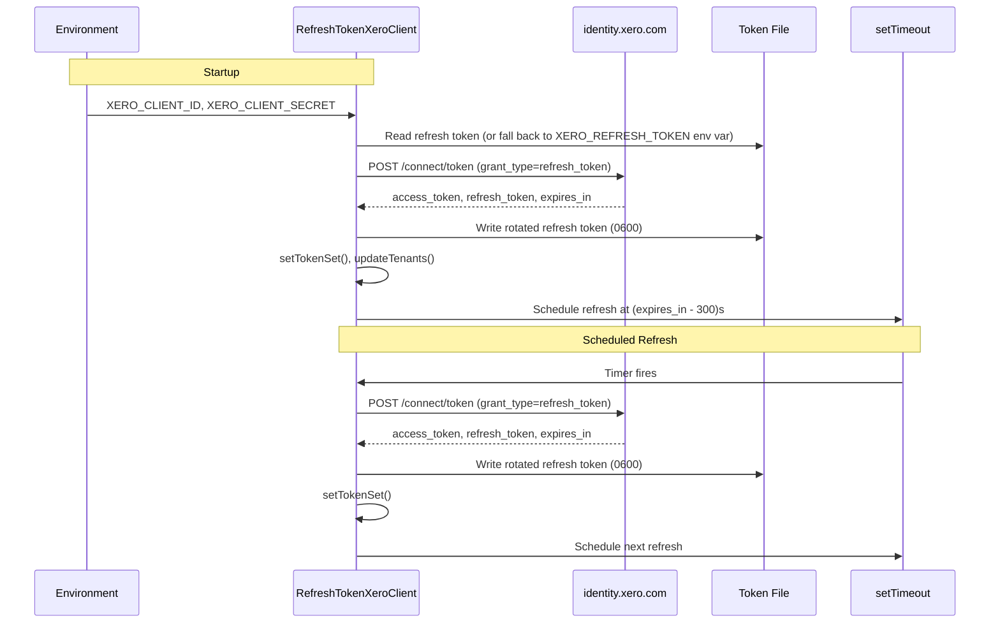

# Design: OAuth2 Web App Auth Flow
**Layer:** backend
**Status:** Confirmed
**Last updated:** 2026-05-25
**Domain language:** Validated against `.specs/GLOSSARY.md` (additions promoted in step 4b).

## Overview

Replace the two-mode auth system (Custom Connection + Bearer Token) in `src/clients/xero-client.ts` with a single **Refresh Token mode** that exchanges a stored refresh token for an access token at startup, persists the rotated refresh token to a **token file**, and schedules proactive in-process token renewal. The design preserves the `MCPXeroClient` base class and its public interface (`authenticate()`, `tenantId`, `getShortCode()`) so that all ~52 handlers continue to work without any changes to their imports or call patterns.

The key architectural decision is to perform authentication once at startup and proactively renew on a timer, rather than the current pattern where `authenticate()` is called before every Xero API request. The `authenticate()` method becomes a guard that ensures the client has been initialised (fail-loud if not) rather than an active token-fetch.

## Architecture

The change is confined to a single file (`src/clients/xero-client.ts`) and its documentation (`README.md`, `.env.example`). No handlers, tools, helpers, or types are modified.



### What stays the same

- `MCPXeroClient` abstract base class: `updateTenants()`, `getShortCode()`, `getOrganisation()`, `tenantId`, `shortCode` fields. All unchanged.
- Module export name: `export const xeroClient`. All 52+ handler files import this name unchanged.
- `dotenv.config()` call at module load time.
- `ensureError` import from helpers.

### What changes

- `CustomConnectionsXeroClient` and `BearerTokenXeroClient` are deleted.
- A new `RefreshTokenXeroClient` class replaces them both.
- Module-level startup validation changes from checking `bearer_token || (client_id && client_secret)` to checking `client_id && client_secret` only.
- The module-level export changes from a conditional ternary to a single `new RefreshTokenXeroClient(...)`.
- `authenticate()` changes from "fetch a token" to "assert the client is initialised".

## Data Model

No database. The only persistent state is the **token file**:

| Aspect | Value |
|---|---|
| Default path | `~/.xero-mcp/refresh_token` |
| Override | `XERO_TOKEN_FILE` env var |
| Contents | Single line: the raw refresh token string (no JSON wrapper, no newline padding) |
| Permissions | `0600` (owner read/write only) |
| Written | After every successful token exchange (startup + each scheduled refresh) |
| Read | At startup only (subsequent refreshes use the in-memory refresh token) |

## API / Interface Design

No new APIs are exposed. The feature consumes the Xero identity endpoint:

- **Endpoint:** `POST https://identity.xero.com/connect/token`
- **Content-Type:** `application/x-www-form-urlencoded`
- **Auth:** `Basic` (base64-encoded `client_id:client_secret`)
- **Body:** `grant_type=refresh_token&refresh_token={token}`
- **Success response (200):** `{ access_token, refresh_token, expires_in, token_type }`
- **Error response (400):** `{ error: "invalid_grant" }` (expired/revoked token)

The public interface of the exported `xeroClient` is unchanged:

```typescript
// What handlers use — unchanged
xeroClient.authenticate(): Promise<void>
xeroClient.tenantId: string
xeroClient.accountingApi: AccountingApi
xeroClient.payrollNZApi: PayrollNzApi
xeroClient.getShortCode(): Promise<string | undefined>
```

## ADR Alignment

**Introduce: ADR 0001 — Refresh Token mode replaces Custom Connection and Bearer Token auth.**

This is the first architecturally significant decision in this fork. It changes the authentication mechanism — a cross-cutting concern that affects every handler's startup path. A draft ADR is written to `.specs/adr/0001-refresh-token-auth-mode.md`.

## Component Breakdown

### 1. Startup validation (module-level, `src/clients/xero-client.ts`)

- **Responsibility:** Read `XERO_CLIENT_ID` and `XERO_CLIENT_SECRET` from env. Throw with a specific message if either is missing.
- **Location:** Module-level code in `src/clients/xero-client.ts`, replacing the existing `if (!bearer_token && ...)` check.
- **Key logic:** Two explicit checks, one per variable, each throwing with the variable name in the message. No combined check — each variable gets its own error.

### 2. Refresh token resolution (private method on `RefreshTokenXeroClient`)

- **Responsibility:** Resolve the initial refresh token using priority order: token file, then `XERO_REFRESH_TOKEN` env var, then throw.
- **Location:** Private method `resolveRefreshToken()` on `RefreshTokenXeroClient`.
- **Key logic:**
  - Resolve token file path: `process.env.XERO_TOKEN_FILE ?? path.join(os.homedir(), '.xero-mcp', 'refresh_token')`.
  - Try `fs.readFileSync(tokenFilePath, 'utf-8').trim()`. If file exists and is non-empty, return it.
  - If file doesn't exist or is empty, check `process.env.XERO_REFRESH_TOKEN`. If set, return it.
  - If neither, throw with a message directing the user to the Xero API Explorer.
  - Store the resolved path on the instance for later writes.

### 3. Token exchange (private method on `RefreshTokenXeroClient`)

- **Responsibility:** POST to Xero identity endpoint with `grant_type=refresh_token`, return the response data.
- **Location:** Private method `exchangeToken(refreshToken: string)` on `RefreshTokenXeroClient`.
- **Key logic:**
  - Uses `axios.post()` with Basic auth header (same pattern as existing `requestToken()`).
  - Body: `grant_type=refresh_token&refresh_token=${refreshToken}`.
  - On success: returns `{ access_token, refresh_token, expires_in, token_type }`.
  - On error: throws with a message indicating the refresh token is invalid/expired and directing to `https://api-explorer.xero.com`.

### 4. Token file persistence (private method on `RefreshTokenXeroClient`)

- **Responsibility:** Write the rotated refresh token to the token file with `0600` permissions, atomically.
- **Location:** Private method `persistRefreshToken(token: string)` on `RefreshTokenXeroClient`.
- **Key logic:**
  - Check that the parent directory exists using `fs.existsSync(path.dirname(tokenFilePath))`. If not, throw with a message naming the missing directory.
  - Write atomically using a temp-then-rename pattern: `fs.writeFileSync(tmpPath, token, { mode: 0o600 }); fs.renameSync(tmpPath, tokenFilePath)` where `tmpPath = tokenFilePath + '.tmp'`. `rename` is atomic on POSIX filesystems, so the token file is always either the previous valid token or the new valid token — never a partial write. This is critical because Xero immediately invalidates the old refresh token on rotation; a corrupted token file would require manual recovery.

### 5. Startup authentication (public method on `RefreshTokenXeroClient`)

- **Responsibility:** Orchestrate the full startup auth flow: resolve token, exchange, persist, set token set, update tenants, schedule refresh.
- **Location:** Public method `authenticate()` on `RefreshTokenXeroClient`, overriding the abstract method.
- **Key logic:**
  - First call: runs the full flow (resolve, exchange, persist, `setTokenSet()`, `updateTenants()`, `scheduleRefresh()`). Sets an `initialised` flag.
  - Subsequent calls: if `initialised` is true, returns immediately (no-op). This preserves the existing handler pattern where every handler calls `await xeroClient.authenticate()` — after startup, these calls are free.
  - Concurrency guard: stores the in-flight promise as `this.authPromise` so concurrent callers share the same promise rather than each running the full startup flow independently. Once `initialised` is true, the promise guard is irrelevant (the `initialised` check short-circuits first). The "throw on subsequent false" branch originally specified here is superseded by the in-flight promise guard — a concurrent call before init returns the same promise; there is no "second call before init" race to guard against.
  - **`setTokenSet()` call:** Pass `{ access_token, expires_in, token_type }` — a partial `TokenSet`, intentionally mirroring the existing `CustomConnectionsXeroClient.authenticate()` pattern. `refresh_token` is deliberately excluded: the server manages the refresh token lifecycle itself and must not pass it into the xero-node token set.

### 6. Scheduled refresh (private method on `RefreshTokenXeroClient`)

- **Responsibility:** Schedule a `setTimeout` to fire at `(expires_in - 300) * 1000` milliseconds. When it fires, exchange the in-memory refresh token, persist the new one, update the token set, and schedule the next refresh.
- **Location:** Private method `scheduleRefresh(expiresIn: number)` on `RefreshTokenXeroClient`.
- **Key logic:**
  - Store the current refresh token in an instance field (`this.currentRefreshToken`).
  - Timer callback: `exchangeToken(this.currentRefreshToken)`, then `persistRefreshToken()`, then `setTokenSet()`, then `scheduleRefresh()` again.
  - `updateTenants()` is NOT called on refresh — tenant ID is stable.
  - If any step fails: log the error to stderr, call `process.exit(1)`.
  - The timer is `unref()`'d so it doesn't prevent the process from exiting if the MCP client disconnects.

### 7. Module export (module-level, `src/clients/xero-client.ts`)

- **Responsibility:** Instantiate the singleton and export it.
- **Location:** Bottom of `src/clients/xero-client.ts`.
- **Key logic:** `export const xeroClient = new RefreshTokenXeroClient({ clientId: client_id, clientSecret: client_secret });`
- **Constructor must call `super({ clientId, clientSecret })`:** The `XeroClient` base class requires `clientId` and `clientSecret` in its config for internal methods (e.g., those used by `updateTenants()`). The constructor must pass these to `super()` — not only store them as instance fields — otherwise `XeroClient` internals that reference `this.config?.clientId` would fail silently at runtime.

### 8. Startup call in entry point (`src/index.ts`)

- **Responsibility:** Call `xeroClient.authenticate()` before wiring tools.
- **Location:** `src/index.ts`, inside the `main()` function.
- **Key logic:** Add `await xeroClient.authenticate();` before `ToolFactory(server);`. The current code does not call authenticate at startup — handlers call it lazily. The new design authenticates eagerly so the server fails fast if tokens are invalid, and so the scheduled refresh timer starts immediately.
- **Import change:** Add `import { xeroClient } from "./clients/xero-client.js";` to `src/index.ts`.

### 9. Documentation updates

- **`.env.example`:** Replace contents with `XERO_CLIENT_ID`, `XERO_CLIENT_SECRET`, `XERO_REFRESH_TOKEN`, and `XERO_TOKEN_FILE` (with comments).
- **`README.md`:** Replace the Authentication section. Remove Custom Connection and Bearer Token subsections. Add a single Refresh Token mode section with step-by-step instructions for obtaining a refresh token via the Xero API Explorer. Update the Claude Desktop config JSON example.

## Error Handling & Edge Cases

| Failure Mode | When | Behaviour |
|---|---|---|
| `XERO_CLIENT_ID` missing | Startup (module load) | Throw: `"XERO_CLIENT_ID is required"` |
| `XERO_CLIENT_SECRET` missing | Startup (module load) | Throw: `"XERO_CLIENT_SECRET is required"` |
| No refresh token source | `authenticate()` | Throw: message directing user to set `XERO_REFRESH_TOKEN` and pointing to `https://api-explorer.xero.com` |
| Token file directory missing | `persistRefreshToken()` | Throw: message naming the missing directory and instructing user to create it |
| Invalid/expired refresh token | `exchangeToken()` (startup) | Throw: message stating token is invalid, directing to `https://api-explorer.xero.com` |
| Network error during exchange | `exchangeToken()` (startup) | Throw: axios error propagated with context |
| Scheduled refresh fails (any reason) | Timer callback | Log error to stderr, `process.exit(1)` |
| Token file write fails (permissions) | `persistRefreshToken()` | Throw (at startup) or `process.exit(1)` (during scheduled refresh) |
| `expires_in` missing from response | `exchangeToken()` | Throw (at startup) or `process.exit(1)` (in timer callback) — a missing `expires_in` indicates a malformed response. A silent default would cause `scheduleRefresh(undefined)` to compute `NaN` and fire immediately in a tight loop. Fail loud. |

**Edge case: `authenticate()` called before startup completes.** Cannot happen — `authenticate()` is awaited in `main()` before `ToolFactory(server)` is called, so no handler can run before auth is complete.

**Edge case: concurrent calls to `authenticate()` before startup completes.** Handled by the in-flight promise guard (`this.authPromise`): all concurrent callers share the same promise and the startup flow runs exactly once. After startup, the `initialised` flag short-circuits all calls synchronously.

**Edge case: token file contains whitespace/newlines.** `trim()` is applied when reading.

## Security & Permissions

- **Token file permissions:** Written with `0o600` (owner read/write only). This prevents other users on the system from reading the refresh token.
- **Refresh token in memory:** Stored as a private instance field. Not logged, not included in error messages.
- **Client secret in memory:** Stored as a private readonly instance field. Not logged.
- **No secrets in error messages:** Error messages for token exchange failures include the Xero error response (which does not contain secrets) but never echo back the refresh token or client secret.
- **`dotenv` loads `.env` once:** No change from current behaviour. `.env` is gitignored.

## Performance Considerations

- **Startup cost:** One additional HTTP round-trip (token exchange) before the server is ready. This adds ~200-500ms to startup, acceptable for an MCP server that starts once and runs for the session.
- **Handler call cost (reduced):** Currently, `CustomConnectionsXeroClient.authenticate()` does a full token exchange on every handler call. The new design does it once at startup. Every subsequent `authenticate()` call is a no-op. This is a net performance improvement.
- **Timer overhead:** One `setTimeout` per token lifetime (~25 minutes). Negligible.
- **File I/O:** One `readFileSync` at startup, one `writeFileSync` per token exchange. Sync I/O is acceptable here because (a) it happens once at startup (before any async work), and (b) the file is tiny (< 1KB). Using sync avoids unnecessary async complexity for a single-line file.

## Dependencies

**Internal:**
- `src/helpers/ensure-error.ts` — used in error formatting (existing, no changes)
- `src/index.ts` — modified to call `authenticate()` at startup

**External:**
- `axios` (transitive via `xero-node`) — HTTP client for token exchange. Already imported in `xero-client.ts`.
- `xero-node` ^13.3.0 — `XeroClient` base class, `setTokenSet()`, `updateTenants()`. No version change.
- Node.js `fs` (built-in) — token file read/write.
- Node.js `path` (built-in) — path resolution.
- Node.js `os` (built-in) — `os.homedir()` for default token file path.

**Removable (not in scope for this feature but noted):**
- `openid-client` ^6.8.1 is a direct dependency in `package.json` but is never imported in source code. It is also a transitive dependency of `xero-node` at a different version (`^5.7.0`). The direct dependency could be removed, but that is outside the scope of FR-8 which only targets code removal within `src/`.

## Testing Strategy
**Mode:** full-tdd
**Rationale:** `RefreshTokenXeroClient` contains conditional startup logic (env var validation, token source priority, file I/O, HTTP token exchange, error handling, scheduled refresh) that has multiple distinct code paths and failure modes. These are runtime behaviours that must be verified with automated tests.
**Framework:** Vitest (to be introduced -- no test framework currently exists in this repo). Vitest is chosen because it is the modern, ESM-native test runner for TypeScript projects with built-in mocking, and it requires minimal configuration for an ESM + TypeScript codebase.
**Test location:** `src/__tests__/clients/xero-client.test.ts`
**Commands:**
  - Run:      `npx vitest run src/__tests__/clients/xero-client.test.ts`
  - Coverage: `npx vitest run --coverage src/__tests__/clients/xero-client.test.ts`
**Done when:** All tests green. Coverage target met. No regressions in adjacent suites.

## Examples

**Example 1 -- Startup with valid token file**
- Given: `XERO_CLIENT_ID=ABC123` and `XERO_CLIENT_SECRET=DEF456` are set. File at `~/.xero-mcp/refresh_token` contains `rt_file_token_001`.
- When: MCP server starts and `authenticate()` is called.
- Then: Server POSTs to `https://identity.xero.com/connect/token` with `grant_type=refresh_token&refresh_token=rt_file_token_001`. Receives `{ access_token: "at_new", refresh_token: "rt_rotated_001", expires_in: 1800 }`. Writes `rt_rotated_001` to `~/.xero-mcp/refresh_token` with `0600` permissions. Calls `setTokenSet()` and `updateTenants()`. Schedules refresh timer at 1500 seconds.
- AC: AC-1

**Example 2 -- Startup falls back to env var when token file absent**
- Given: `XERO_CLIENT_ID=ABC123`, `XERO_CLIENT_SECRET=DEF456`, `XERO_REFRESH_TOKEN=rt_env_seed_001` are set. No file at `~/.xero-mcp/refresh_token`.
- When: MCP server starts and `authenticate()` is called.
- Then: Server uses `rt_env_seed_001` for the exchange. After success, writes the rotated token to `~/.xero-mcp/refresh_token`.
- AC: AC-2

**Example 3 -- Token file takes priority over env var**
- Given: File at `~/.xero-mcp/refresh_token` contains `rt_file_newer`. `XERO_REFRESH_TOKEN=rt_env_older` is also set.
- When: `resolveRefreshToken()` is called.
- Then: Returns `rt_file_newer`. The env var value `rt_env_older` is never used.
- AC: AC-3

**Example 4 -- No token source throws with guidance**
- Given: No file at `~/.xero-mcp/refresh_token`. `XERO_REFRESH_TOKEN` is not set.
- When: `resolveRefreshToken()` is called.
- Then: Throws an error whose message contains `XERO_REFRESH_TOKEN` and `https://api-explorer.xero.com`.
- AC: AC-4

**Example 5 -- Missing XERO_CLIENT_ID throws at module load**
- Given: `XERO_CLIENT_ID` is not set. `XERO_CLIENT_SECRET=DEF456` is set.
- When: `src/clients/xero-client.ts` is imported.
- Then: Module throws `"XERO_CLIENT_ID is required"`.
- AC: AC-5

**Example 6 -- Missing XERO_CLIENT_SECRET throws at module load**
- Given: `XERO_CLIENT_ID=ABC123` is set. `XERO_CLIENT_SECRET` is not set.
- When: `src/clients/xero-client.ts` is imported.
- Then: Module throws `"XERO_CLIENT_SECRET is required"`.
- AC: AC-5

**Example 7 -- Expired refresh token throws with guidance**
- Given: `XERO_REFRESH_TOKEN=rt_expired_001` is set. Xero returns `{ error: "invalid_grant" }` with status 400.
- When: `exchangeToken("rt_expired_001")` is called during startup.
- Then: Throws an error whose message contains "invalid" and `https://api-explorer.xero.com`.
- AC: AC-6

**Example 8 -- Token file directory does not exist**
- Given: `XERO_TOKEN_FILE=/nonexistent/dir/refresh_token`. Token exchange succeeds and returns `rt_rotated_002`.
- When: `persistRefreshToken("rt_rotated_002")` is called.
- Then: Throws an error whose message contains `/nonexistent/dir` and instructs the user to create the directory.
- AC: AC-7

**Example 9 -- Scheduled refresh succeeds**
- Given: Server is running. `this.currentRefreshToken` is `rt_current_001`. Timer fires at `expires_in - 300` seconds.
- When: The timer callback executes.
- Then: POSTs to Xero with `refresh_token=rt_current_001`. Receives `{ access_token: "at_renewed", refresh_token: "rt_rotated_003", expires_in: 1800 }`. Writes `rt_rotated_003` to token file. Updates in-memory token set. Schedules next timer at 1500 seconds. Does NOT call `updateTenants()`.
- AC: AC-8

**Example 10 -- Scheduled refresh failure crashes the process**
- Given: Server is running. Timer fires. Xero returns HTTP 400 `{ error: "invalid_grant" }`.
- When: The timer callback catches the error.
- Then: Error is logged to stderr. `process.exit(1)` is called.
- AC: AC-9

**Example 11 -- authenticate() is a no-op after startup**
- Given: Server has completed startup authentication. `initialised` is `true`.
- When: A handler calls `await xeroClient.authenticate()`.
- Then: Returns immediately without making any HTTP calls or file I/O.
- AC: AC-1 (implicit -- handlers continue to work)

**Example 12 -- Old auth code is fully removed**
- Given: Implementation is complete.
- When: `grep -r "client_credentials\|XERO_SCOPES\|XERO_CLIENT_BEARER_TOKEN\|BearerTokenXeroClient\|CustomConnectionsXeroClient\|XERO_DEFAULT_AUTH_SCOPES" src/` is run.
- Then: Returns no results.
- AC: AC-10

**Example 13 -- Custom XERO_TOKEN_FILE path is respected**
- Given: `XERO_TOKEN_FILE=/tmp/custom-xero-token`. File at `/tmp/custom-xero-token` contains `rt_custom_path`.
- When: `resolveRefreshToken()` is called.
- Then: Returns `rt_custom_path`. Token file writes go to `/tmp/custom-xero-token`.
- AC: AC-1 (variant)

**Example 14 -- Token file with trailing whitespace is trimmed**
- Given: File at `~/.xero-mcp/refresh_token` contains `rt_with_spaces  \n`.
- When: `resolveRefreshToken()` is called.
- Then: Returns `rt_with_spaces` (trimmed).
- AC: AC-1 (edge case)

## Open Questions

None. All design decisions are resolved from requirements.
