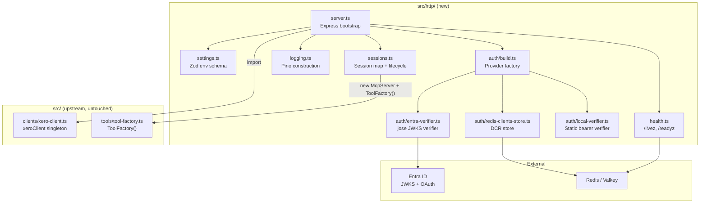
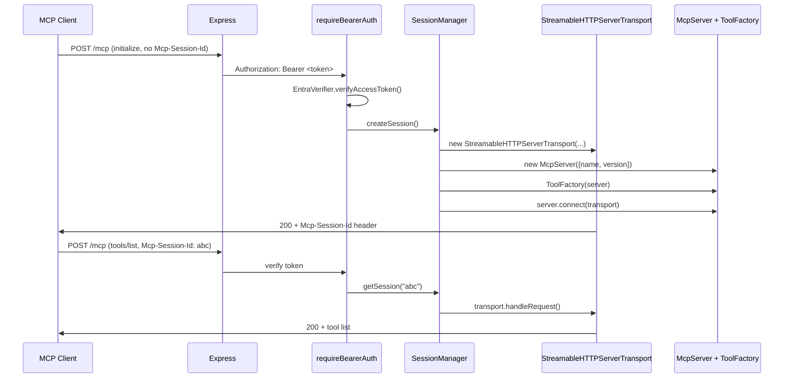

# Design: HTTP Transport and Entra OAuth
**Layer:** backend
**Status:** Confirmed
**Last updated:** 2026-05-26
**Domain language:** Validated against `.specs/GLOSSARY.md` (additions promoted in step 4b).

## Overview

This design adds a second entry point (`src/http/server.ts` -> `dist/http/server.js`) that serves MCP over Streamable HTTP with per-session transports, gated by bearer auth. In `ENVIRONMENT=local` the bearer is a static token; in all other environments it is an Entra ID JWT validated via `jose`. The MCP TS SDK's `ProxyOAuthServerProvider` and `mcpAuthRouter` handle DCR, authorize, and token endpoints, with a Redis-backed `OAuthRegisteredClientsStore` so registrations survive pod restarts.

Every new file lives under `src/http/` and `src/http/auth/`. No existing upstream file in `src/` is modified. The existing stdio entry at `src/index.ts` continues to work identically. Additive-only edits to `package.json` and `.env.example`.

## Architecture

The HTTP entry point mirrors the structure of the existing stdio entry (`src/index.ts`) but replaces `StdioServerTransport` with per-session `StreamableHTTPServerTransport` instances managed in a `Map`. Each session gets its own `McpServer` + `ToolFactory` wiring, so concurrent MCP clients are fully isolated.



**Request flow (non-local):**



### Upstream isolation

| Path | Modified | Rationale |
|------|----------|-----------|
| `src/index.ts`, `src/clients/*`, `src/handlers/*`, `src/tools/*`, `src/server/*`, `src/helpers/*`, `src/types/*`, `src/consts/*` | No | Upstream-owned; zero-diff merge target |
| `src/http/**` | New | All new code for this feature |
| `package.json` | Additive only | New deps, one script, one bin entry |
| `.env.example` | Additive only | Appended OSB section |
| `tsconfig.json`, `eslint.config.js`, `.prettierrc` | No | Upstream-owned; existing `src/**/*` glob already includes `src/http/` |

### Reuse strategy

- `xeroClient` singleton: imported from `../clients/xero-client.js`. Module-load triggers `dotenv.config()` and the `XERO_CLIENT_ID`/`XERO_CLIENT_SECRET` guards. `server.ts` calls `await xeroClient.authenticate()` at startup, matching the stdio entry.
- `ToolFactory()`: imported from `../tools/tool-factory.js`. Called once per session with the fresh `McpServer` instance. Registers all ~70 upstream tools.
- `McpServer`: instantiated directly from `@modelcontextprotocol/sdk/server/mcp.js`. The upstream `XeroMcpServer.GetServer()` singleton is **not** used because it returns a single shared instance, incompatible with per-session isolation.

### xeroClient.initialised is private

The `initialised` field on `RefreshTokenXeroClient` is `private`. The `/readyz` endpoint needs to know whether Xero auth succeeded. Instead of modifying the upstream file, `server.ts` will track this itself with a module-level `let xeroReady = false` flag that is set to `true` after `await xeroClient.authenticate()` resolves. This flag is passed to the health module via a closure or getter.

## Data Model

No database tables. The only persistent state is the Redis-backed DCR client registrations:

| Key pattern | Value | TTL | Purpose |
|---|---|---|---|
| `oauth:clients:{client_id}` | JSON-serialised `OAuthClientInformationFull` | None (persists until manual eviction) | DCR registrations survive pod restarts |

No encryption at rest in this iteration (explicit follow-up per requirements Non-Goals).

## API / Interface Design

All HTTP endpoints are either MCP-spec-defined or SDK-provided. No custom REST API to design.

| Endpoint | Method | Auth | Source |
|---|---|---|---|
| `/livez` | GET | None | `health.ts` |
| `/readyz` | GET | None | `health.ts` |
| `/mcp` | POST, GET, DELETE | `requireBearerAuth` | `server.ts` via `StreamableHTTPServerTransport.handleRequest()` |
| `/register` | POST | SDK-managed | `mcpAuthRouter` (non-local only) |
| `/authorize` | GET | SDK-managed | `mcpAuthRouter` (non-local only) |
| `/token` | POST | SDK-managed | `mcpAuthRouter` (non-local only) |
| `/.well-known/oauth-authorization-server` | GET | None | `mcpAuthRouter` (non-local only) |
| `/.well-known/oauth-protected-resource` | GET | None | `mcpAuthRouter` (non-local only) |

## ADR Alignment

| ADR | Relationship | Notes |
|---|---|---|
| [0001 -- Refresh Token auth mode](../../adr/0001-refresh-token-auth-mode.md) | **Adopt** | HTTP entry imports `xeroClient` and calls `authenticate()` identically to the stdio entry. Token rotation continues unchanged. |
| [0002 -- MCP HTTP transport and OAuth](../../adr/0002-mcp-http-transport-and-oauth.md) | **Introduce** | New ADR. Captures why MCP-spec OAuth lives inside the server (vs. external proxy) and why Streamable HTTP (vs. SSE). Drafted alongside this design. Note: the `Object.defineProperty` injection technique for wiring `RedisOAuthClientsStore` into `ProxyOAuthServerProvider` is a design-level detail documented in this design.md, not in the ADR itself (the ADR describes the architectural decision, not the SDK wiring mechanics). |
| [0003 -- OAuth state in Redis](../../adr/0003-oauth-state-in-redis.md) | **Introduce** | New ADR. Captures why DCR state is Redis-backed. Mirrors cin7-mcp ADR-0002, adapted for the Node SDK (no encryption at rest in v0). |

## Component Breakdown

### 1. `src/http/settings.ts` -- Environment configuration

**Responsibility:** Validate and export a frozen settings object from environment variables using `zod`. Conditionally require Entra/Redis fields when `ENVIRONMENT !== "local"`.

**Location:** `src/http/settings.ts`

**Key logic:**
- Base schema: `ENVIRONMENT` (enum `local | development | production`), `MCP_BIND_HOST` (default `0.0.0.0`), `MCP_BIND_PORT` (default `8000`, coerced number), `LOG_LEVEL` (default `info`), `MCP_SESSION_IDLE_TIMEOUT_SECONDS` (default `1800`, coerced number), `MCP_MAX_SESSIONS` (default `100`, coerced number).
- Conditional required fields via `z.superRefine`:
  - When `ENVIRONMENT === "local"`: `DEV_BEARER_TOKEN` must be a non-empty string.
  - When `ENVIRONMENT !== "local"`: `ENTRA_TENANT_ID`, `ENTRA_CLIENT_ID`, `MCP_SERVER_URL`, `ENTRA_REQUIRED_SCOPES`, `REDIS_URL` must all be non-empty strings. (`ENTRA_CLIENT_SECRET` was removed in build iteration 3 — token verification uses Entra's JWKS public keys and DCR-issued client secrets, not a server-side app secret. See ADR-0002.)
- Export type: `Settings` (inferred from the schema).
- Call `dotenv.config()` at the start of `loadSettings()`. Dotenv is idempotent -- calling it after upstream's `xero-client.ts` already loaded `.env` is a no-op, and calling it from standalone tests of `settings.ts` works without depending on import order.
- On parse failure, throw with `ZodError` message that names the offending variable(s).
- The function returns a discriminated union narrowed by `ENVIRONMENT`:
  - `LocalSettings`: guarantees `DEV_BEARER_TOKEN: string`.
  - `NonLocalSettings`: guarantees all five Entra/Redis fields (`ENTRA_TENANT_ID`, `ENTRA_CLIENT_ID`, `MCP_SERVER_URL`, `ENTRA_REQUIRED_SCOPES`, `REDIS_URL`) as `string`.
  - Union: `Settings = LocalSettings | NonLocalSettings`.
- This discriminated-union approach eliminates the need for runtime assertions (unlike cin7-mcp's mypy-narrowing `assert`s) because TypeScript's control flow narrows `settings.ENVIRONMENT === "local"` automatically.

### 2. `src/http/logging.ts` -- Structured logger

**Responsibility:** Construct and export a `pino` logger instance and a `pino-http` middleware.

**Location:** `src/http/logging.ts`

**Key logic:**
- `createLogger(level: string)` returns a `pino.Logger` with `level`, `timestamp: pino.stdTimeFunctions.isoTime`.
- `createHttpLogger(logger: pino.Logger)` returns a `pino-http` middleware configured to:
  - Log a single line per request with `method`, `path` (mapped from `req.url`), `status` (mapped from `res.statusCode`), `durationMs` (mapped from `responseTime`), and `sessionId` (extracted from `req.headers["mcp-session-id"]` if present).
  - Silence `/livez` and `/readyz` at info level (only log at debug) to avoid probe spam.
  - Use the parent logger's level.

### 3. `src/http/auth/local-verifier.ts` -- Static bearer verifier

**Responsibility:** Implement `OAuthTokenVerifier` for `ENVIRONMENT=local`.

**Location:** `src/http/auth/local-verifier.ts`

**Key logic:**
- Constructor takes `devBearerToken: string`.
- `verifyAccessToken(token: string): Promise<AuthInfo>`:
  - If `token === this.devBearerToken`: return `{ token, clientId: "dev-local", scopes: ["mcp"], expiresAt: undefined }`.
  - Otherwise: `throw new InvalidTokenError("Invalid dev bearer token")` (imported from `@modelcontextprotocol/sdk/server/auth/errors.js`).

### 4. `src/http/auth/entra-verifier.ts` -- Entra JWT verifier

**Responsibility:** Implement `OAuthTokenVerifier` for non-local environments.

**Location:** `src/http/auth/entra-verifier.ts`

**Key logic:**
- Constructor takes `{ tenantId: string, clientId: string, requiredScopes: string[] }`.
- Constructs its `RemoteJWKSet` via `jose.createRemoteJWKSet(new URL(jwksUrl))` where `jwksUrl = https://login.microsoftonline.com/${tenantId}/discovery/v2.0/keys`. The JWKS instance is stored as a private field on the class, not as a module-level variable. This ensures the same JWKS fetch path is used at both startup (probe) and runtime (token verification) -- no separate fetch URL constant, no duplicate cache.
- `verifyAccessToken(token: string): Promise<AuthInfo>`:
  1. `jose.jwtVerify(token, this.jwks, { issuer, audience })` where:
     - `issuer = https://login.microsoftonline.com/${tenantId}/v2.0`
     - `audience = api://${clientId}`
  2. Extract `scp` claim (space-delimited string) from the payload. Split into an array.
  3. Assert every scope in `requiredScopes` is present in the `scp` array. If not, throw `InsufficientScopeError` (from SDK errors).
  4. Return `AuthInfo { token, clientId: payload.sub ?? payload.oid ?? "unknown", scopes: scpArray, expiresAt: payload.exp }`.
- **Selective catch** on `JOSEError` only: `catch (err) { if (err instanceof jose.errors.JOSEError) throw new InvalidTokenError(err.message); throw err; }`. The catch MUST NOT swallow non-jose errors. Network-level failures from the underlying JWKS fetch (`TypeError("fetch failed")`, DNS failures, HTTP error status from `RemoteJWKSet`) are NOT `JOSEError` instances — they must propagate so `server.ts` can discriminate "JWKS unreachable" from "token rejected".
- **Startup probe sentinel — must be a structurally-valid JWT, not an arbitrary string.** `server.ts` warms the JWKS at startup by calling `verifier.verifyAccessToken(STARTUP_PROBE_JWT)` where `STARTUP_PROBE_JWT` is the constant `"eyJhbGciOiJSUzI1NiIsImtpZCI6InN0YXJ0dXAtcHJvYmUifQ.eyJpc3MiOiJzdGFydHVwLXByb2JlIn0.invalid"` (header `{alg:"RS256",kid:"startup-probe"}`, payload `{iss:"startup-probe"}`, junk signature; exported from `src/http/auth/entra-verifier.ts`). This MUST be structurally valid — an arbitrary string like `"mcp-startup-probe"` would fail `jose.jwtVerify`'s structural parse with `JWSInvalid` **before** any JWKS fetch is attempted, defeating the probe (it would pass even when Entra is unreachable). With a structurally-valid sentinel:
  - JWKS reachable, no matching `kid` → `JWKSNoMatchingKey` (a `JOSEError`) → caught → `InvalidTokenError` → `server.ts` reads "probe succeeded" (JWKS was reached and parsed).
  - JWKS endpoint unreachable → `TypeError("fetch failed")` / network error → NOT caught (not a `JOSEError`) → propagates → `server.ts` reads "probe failed" → crash with `"Entra JWKS unreachable: ${jwksUrl}"`.

This dual-purpose pattern eliminates the separate `probeEntraJwks` function and its duplicate URL construction. The discriminator is the `JOSEError` class boundary, not the error message.

### 5. `src/http/auth/redis-clients-store.ts` -- Redis DCR storage

**Responsibility:** Implement `OAuthRegisteredClientsStore` backed by node-redis v4.

**Location:** `src/http/auth/redis-clients-store.ts`

**Key logic:**
- Constructor takes a `redis: { get: (key: string) => Promise<string | null>, set: (key: string, value: string) => Promise<unknown> }` (narrowed to the two operations actually used).
- Key pattern: `oauth:clients:${clientId}`.
- `getClient(clientId: string): Promise<OAuthClientInformationFull | undefined>`:
  - `const raw = await this.redis.get(key)`.
  - If `null`, return `undefined`.
  - Parse JSON, return as `OAuthClientInformationFull`.
- `registerClient(client: Omit<OAuthClientInformationFull, "client_id" | "client_id_issued_at">): Promise<OAuthClientInformationFull>`:
  - Generate `client_id` via `randomUUID()`.
  - Set `client_id_issued_at` to `Math.floor(Date.now() / 1000)`.
  - Compose the full `OAuthClientInformationFull` object.
  - `await this.redis.set(key, JSON.stringify(full))` with no TTL.
  - Return `full`.
- **Single source of truth for `client_id` generation:** The store is the sole owner of `client_id` and `client_id_issued_at`. The `mcpAuthRouter`'s `clientRegistrationOptions` sets `clientIdGeneration: false` so the SDK's `clientRegistrationHandler` does NOT generate a `client_id` before calling `registerClient`. This avoids double-generation (the SDK's default `clientIdGeneration: true` would generate one, our store would overwrite it) and makes the store the unambiguous authority.
- No encryption at rest (explicit follow-up).

### 6. `src/http/auth/build.ts` -- Auth provider factory

**Responsibility:** Construct the correct auth provider, verifier, and scopes based on `settings.ENVIRONMENT`.

**Location:** `src/http/auth/build.ts`

**Key logic:**
- `buildAuth` uses TypeScript function overloads to enforce type-safe argument requirements:
  ```ts
  function buildAuth(settings: LocalSettings): { verifier: OAuthTokenVerifier, requiredScopes: string[] };
  function buildAuth(settings: NonLocalSettings, redisClient: RedisClientType): { provider: ProxyOAuthServerProvider, verifier: OAuthTokenVerifier, requiredScopes: string[] };
  function buildAuth(settings: Settings, redisClient?: RedisClientType) { ... }
  ```
  The overloads eliminate the need for `redisClient!` non-null assertions -- when `settings` is `NonLocalSettings`, TypeScript requires `redisClient` as the second argument.
- **Local branch** (`settings.ENVIRONMENT === "local"`):
  - `verifier = new LocalBearerVerifier(settings.DEV_BEARER_TOKEN)`.
  - Returns `{ verifier, requiredScopes: ["mcp"] }`. No `provider` property (local mode has no `mcpAuthRouter`).
- **Non-local branch**:
  - `verifier = new EntraVerifier({ tenantId, clientId, requiredScopes })`.
  - `store = new RedisOAuthClientsStore({ get: redisClient.get.bind(redisClient), set: redisClient.set.bind(redisClient) })`.
  - `provider = new ProxyOAuthServerProvider({ endpoints: { authorizationUrl, tokenUrl }, verifyAccessToken: (token) => verifier.verifyAccessToken(token), getClient: (id) => store.getClient(id) })`.
  - Override the provider's `clientsStore` getter so it returns the full `RedisOAuthClientsStore` (including `registerClient`): `Object.defineProperty(provider, 'clientsStore', { value: store })`.
  - `requiredScopes = settings.ENTRA_REQUIRED_SCOPES.split(",")`.
  - `authorizationUrl = https://login.microsoftonline.com/${settings.ENTRA_TENANT_ID}/oauth2/v2.0/authorize`.
  - `tokenUrl = https://login.microsoftonline.com/${settings.ENTRA_TENANT_ID}/oauth2/v2.0/token`.
  - Returns `{ provider, verifier, requiredScopes }`.

**Why `Object.defineProperty` is needed:**

The SDK's `ProxyOAuthServerProvider` has a `clientsStore` getter that conditionally includes `registerClient` only when `endpoints.registrationUrl` is provided. Since we proxy DCR locally (not to Entra), we don't pass a `registrationUrl`. This means the default getter returns `{ getClient }` without `registerClient`, and the SDK's `mcpAuthRouter` -- which reads `provider.clientsStore.registerClient` to decide whether to mount `/register` -- silently skips DCR.

The `mcpAuthRouter`'s `clientRegistrationOptions` type is `Omit<ClientRegistrationHandlerOptions, 'clientsStore'>` -- the `clientsStore` field is explicitly excluded. The router always reads `clientsStore` from `provider.clientsStore`. Under `strict: true`, passing `clientsStore` through `clientRegistrationOptions` would not compile.

`Object.defineProperty(provider, 'clientsStore', { value: store })` overrides the getter on the instance so `provider.clientsStore` returns our `RedisOAuthClientsStore` (which has `registerClient`). The router then finds `registerClient` and mounts `/register`.

**Rejected alternative:** Subclassing `ProxyOAuthServerProvider` to override the getter. More code, no additional safety. The single `Object.defineProperty` line is simpler and the override's intent is documented here.

### 7. `src/http/sessions.ts` -- Session lifecycle manager

**Responsibility:** Own the `Map<string, SessionEntry>` and all session lifecycle operations: create, lookup, delete, idle-eviction, and cap enforcement.

**Location:** `src/http/sessions.ts`

**Key logic:**
- `SessionEntry` type: `{ transport: StreamableHTTPServerTransport, server: McpServer, lastActivity: number }`.
- `SessionManager` class:
  - `private sessions: Map<string, SessionEntry>`.
  - Constructor takes `{ maxSessions: number, idleTimeoutMs: number, serverIdentity: { name: string, version: string }, logger: pino.Logger }`.
  - `createSession(): { sessionId: string, transport: StreamableHTTPServerTransport }`:
    1. If `sessions.size >= maxSessions`, throw a `SessionCapError` (custom error; `server.ts` catches this and returns 503).
    2. `const sessionId = randomUUID()`.
    3. `const transport = new StreamableHTTPServerTransport({ sessionIdGenerator: () => sessionId, onsessionclosed: () => this.deleteSession(sessionId) })`.
    4. `const server = new McpServer({ name: this.serverIdentity.name, version: this.serverIdentity.version })`.
    5. `ToolFactory(server)`.
    6. `await server.connect(transport)`.
    7. Insert `{ transport, server, lastActivity: Date.now() }` keyed by `sessionId`.
    8. Log `session_created` at info level.
    9. Return `{ sessionId, transport }`.
  - `getSession(sessionId: string): SessionEntry | undefined`:
    - Look up by key. If found, update `lastActivity = Date.now()` and return.
  - `deleteSession(sessionId: string): void`:
    - **Remove the entry from the map first**, then call `transport.close()`. This ordering is critical: `transport.close()` fires the transport's `onsessionclosed` callback, which calls `deleteSession(sessionId)` again. The re-entrant call finds no entry in the map and returns immediately, preventing an infinite loop.
    - Log `session_closed` at info level.
  - `evictIdleSessions(): void`:
    - For each entry, if `Date.now() - lastActivity > idleTimeoutMs`, call `deleteSession`. Log `session_evicted` at info.
  - `startEvictionTimer(): NodeJS.Timeout`:
    - `setInterval(() => this.evictIdleSessions(), 60_000).unref()`.
  - `get size(): number` -- returns `sessions.size`.

Note: `createSession()` is `async` because `server.connect(transport)` is async. The caller in the `/mcp` handler awaits it.

### 8. `src/http/health.ts` -- Health endpoints

**Responsibility:** Express router factory that returns `/livez` and `/readyz` routes.

**Location:** `src/http/health.ts`

**Key logic:**
- `createHealthRouter(deps: { redisClient?: RedisClientType, isXeroReady: () => boolean }): express.Router`:
  - `/livez` (GET): always `200 { "status": "ok" }`.
  - `/readyz` (GET):
    1. If `!deps.isXeroReady()`: `503 { "status": "unavailable", "reason": "xero" }`.
    2. If `deps.redisClient` is provided: attempt `await redisClient.ping()` with a 1-second timeout. On failure: `503 { "status": "unavailable", "reason": "redis" }`.
    3. Otherwise: `200 { "status": "ok" }`.
  - In `ENVIRONMENT=local`, `server.ts` passes `redisClient: undefined`, so the Redis check is skipped.
- The router is mounted **before** any auth middleware on the Express app.

### 9. `src/http/server.ts` -- HTTP entry point

**Responsibility:** Bootstrap the Express application, wire all components, and start listening.

**Location:** `src/http/server.ts`

**Key logic -- startup sequence:**
1. `#!/usr/bin/env node` shebang (same as `src/index.ts`).
2. Import `xeroClient` from `../clients/xero-client.js` (side-effect: `dotenv.config()` + env var guards).
3. Import `ToolFactory` from `../tools/tool-factory.js`.
4. Call `loadSettings()` -- parse and validate env vars via zod. Throws on invalid config.
5. `const logger = createLogger(settings.LOG_LEVEL)`.
6. Read `name` and `version` from `package.json` using `import { createRequire } from "node:module"` + `createRequire(import.meta.url)("../../package.json")`. Freeze as `const SERVER_IDENTITY = Object.freeze({ name: pkg.name, version: pkg.version })`. (Using `createRequire` because `import ... assert { type: "json" }` is still stage 3 and not universally supported.)
7. `let xeroReady = false`.
8. `await xeroClient.authenticate()` -> `xeroReady = true`.
9. If non-local:
   - Create Redis client: `import { createClient } from "redis"` -> `const redisClient = createClient({ url: settings.REDIS_URL })` -> `await redisClient.connect()` -> `await redisClient.ping()`. On failure: `throw new Error("Redis unreachable: ${safeRedisUrl(settings.REDIS_URL)}")` — `safeRedisUrl` strips embedded credentials before logging.
   - Call `buildAuth(settings, redisClient)` -- returns `{ provider, verifier, requiredScopes }`.
   - Warm the Entra JWKS by importing `STARTUP_PROBE_JWT` from `./auth/entra-verifier.js` and calling `verifier.verifyAccessToken(STARTUP_PROBE_JWT)` inside a try/catch. If it throws `InvalidTokenError`, the probe succeeded — the JWKS endpoint was reached and the keyset was parsed; the (structurally valid) sentinel was correctly rejected. If it throws **any other error** (a non-`JOSEError` propagated by the selective catch in `verifyAccessToken` — typically `TypeError("fetch failed")` for network failures, DNS resolution errors, or HTTP error responses from the JWKS endpoint), rethrow as `new Error("Entra JWKS unreachable: ${jwksUrl}")`. Catching `InvalidTokenError` specifically is what makes the discrimination work — see Component 4 for why an arbitrary sentinel string would fail this contract.
10. If local: call `buildAuth(settings)` -- returns `{ verifier, requiredScopes }`.
11. Create `SessionManager` with `{ maxSessions, idleTimeoutMs, serverIdentity, logger }`.
12. Create Express app:
    - `express.json()` body parser.
    - `pino-http` middleware.
    - Mount health router (before auth): `app.use(healthRouter)`.
    - If non-local: mount `mcpAuthRouter({ provider, issuerUrl: new URL(settings.MCP_SERVER_URL), baseUrl: new URL(settings.MCP_SERVER_URL), resourceServerUrl: new URL(settings.MCP_SERVER_URL), scopesSupported: requiredScopes, clientRegistrationOptions: { clientSecretExpirySeconds: 60 * 60 * 24 * 365, clientIdGeneration: false } })`. Note: `clientIdGeneration: false` because `RedisOAuthClientsStore` is the sole owner of `client_id` generation (see Component 5). No `clientsStore` in `clientRegistrationOptions` -- the router reads it from `provider.clientsStore`, which has been overridden via `Object.defineProperty` in `buildAuth` (see Component 6).
    - Mount `/mcp` handler with `requireBearerAuth({ verifier, requiredScopes, resourceMetadataUrl: ... })`.
13. `/mcp` handler (all methods: POST, GET, DELETE):
    - Extract `Mcp-Session-Id` from `req.headers["mcp-session-id"]`.
    - **No session ID + POST with `initialize` method in body**: create session via `sessionManager.createSession()`. Catch `SessionCapError` -> 503 `{"error":"session_cap_reached"}`. Forward to `transport.handleRequest(req, res, req.body)`.
    - **Has session ID**: look up via `sessionManager.getSession(sessionId)`. If not found: 404 `{"jsonrpc":"2.0","error":{"code":-32000,"message":"Session not found"},"id":null}`. Otherwise forward to `transport.handleRequest(req, res, req.body)`.
14. Start eviction timer: `sessionManager.startEvictionTimer()`.
15. `app.listen(settings.MCP_BIND_PORT, settings.MCP_BIND_HOST, () => logger.info({ msg: "server_started", host, port }))`.
16. The entire startup is wrapped in an async IIFE with `.catch()` -> `logger.fatal(...)` + `process.exit(1)`.

**No CORS:** No `cors()` middleware. No `Access-Control-Allow-*` headers. The Express default for unmatched `OPTIONS` requests returns 404.

**Server identity from package.json:** Read once at boot, passed to every per-session `McpServer` via `SessionManager.serverIdentity`.

### 10. `package.json` -- Additive edits

**Location:** `package.json` (root)

**Changes (additive only):**
- `dependencies` (alphabetical insert): `express`, `jose`, `pino`, `pino-http`, `redis`.
- `devDependencies` (alphabetical insert): `@types/express`, `supertest`, `@types/supertest`.
- `scripts`: add `"start:http": "node dist/http/server.js"`.
- `bin`: change from string `"./dist/index.js"` to object `{ "xero-mcp-server": "./dist/index.js", "xero-mcp-http": "./dist/http/server.js" }`. The existing `"bin": "./dist/index.js"` is a shorthand for `{ "@xeroapi/xero-mcp-server": "./dist/index.js" }`. Expanding to an object and adding a second entry is additive.
- `build` script: update from `"tsc && shx chmod +x dist/*.js"` to `"tsc && shx chmod +x dist/*.js dist/http/*.js"` so the HTTP entry point is also executable.

### 11. `.env.example` -- Additive OSB section

**Location:** `.env.example` (root)

**Changes:** Append a clearly-marked section after the existing Xero entries. The three upstream entries remain byte-for-byte identical. Style mirrors cin7-mcp's `.env.example`:

```
# -- OSB HTTP Mode (src/http/server.ts) --------------------------------------------------------
# These variables are only used by the HTTP entry point (dist/http/server.js).
# The stdio entry (dist/index.js) ignores them.

# One of: local | development | production
ENVIRONMENT=local

# Log verbosity: trace | debug | info | warn | error | fatal
LOG_LEVEL=info

# -- Server bind -------------------------------------------------------------------------------
MCP_BIND_HOST=0.0.0.0
MCP_BIND_PORT=8000

# -- Local dev auth ----------------------------------------------------------------------------
# Required when ENVIRONMENT=local. Use a random string; never a real secret.
DEV_BEARER_TOKEN=changeme-replace-with-a-random-string

# -- Entra ID auth (required when ENVIRONMENT=development or production) -----------------------
ENTRA_TENANT_ID=
ENTRA_CLIENT_ID=

# Public HTTPS base URL of this server -- used as the OAuth issuer/redirect URI.
# Required when ENVIRONMENT != "local".
# Example: https://xero-mcp.tail-xxxx.ts.net
MCP_SERVER_URL=

# Scopes required on incoming Entra tokens. Comma-separated, no spaces.
# REQUIRED when ENVIRONMENT != "local".
# Example: mcp
ENTRA_REQUIRED_SCOPES=

# -- Redis (required when ENVIRONMENT != "local") ---------------------------------------------
# Connection URL for the Redis-compatible store (Valkey, Redis, etc).
REDIS_URL=redis://localhost:6379/0

# -- Session management ------------------------------------------------------------------------
# Idle timeout in seconds before a session is evicted. Default: 1800 (30 min).
# MCP_SESSION_IDLE_TIMEOUT_SECONDS=1800

# Maximum concurrent MCP sessions. New initialize requests return 503 at cap.
# MCP_MAX_SESSIONS=100
```

## Error Handling & Edge Cases

| Failure mode | Response | Notes |
|---|---|---|
| Missing/invalid env var at startup | Process exits non-zero; zod error names the offending variable | FR-3, AC-8 |
| Xero auth failure at startup | Process exits non-zero; upstream error propagated | FR-2 |
| Redis unreachable at startup (non-local) | Process exits non-zero; `"Redis unreachable: {url}"` | FR-4, AC-6 |
| Entra JWKS unreachable at startup (non-local) | Process exits non-zero; `"Entra JWKS unreachable: {url}"` | FR-4, AC-7 |
| Missing bearer on `/mcp` | 401 with `WWW-Authenticate: Bearer ...` | SDK's `requireBearerAuth` handles this |
| Invalid/expired bearer on `/mcp` | 401 with `WWW-Authenticate: Bearer error="invalid_token"` | AC-10 |
| Valid bearer, missing scope | 403 with `error="insufficient_scope"` | AC-9 |
| `/mcp` POST initialize when session cap reached | 503 `{"error":"session_cap_reached"}` | FR-15, AC-14 |
| `/mcp` request with unknown `Mcp-Session-Id` | 404 JSON error body | FR-12, AC-13 (after eviction) |
| Redis unreachable mid-life (non-local) | `/readyz` returns 503; `/mcp` requests may fail on DCR lookup | AC-17 |
| Xero not initialised when `/readyz` called | 503 `{"status":"unavailable","reason":"xero"}` | AC-16 |
| Idle session exceeds timeout | Evicted on next 60s sweep; subsequent requests return 404 | FR-14, AC-13 |
| `DELETE /mcp` with valid session | 200; session removed; subsequent requests return 404 | FR-13, AC-15 |
| Re-entrant `deleteSession` from `onsessionclosed` | Map entry already removed; re-entrant call returns immediately | Component 7 ordering guarantee |

## Security & Permissions

- **Bearer auth on `/mcp`:** Every request gated by `requireBearerAuth`. The SDK's middleware handles `WWW-Authenticate` headers per RFC 6750.
- **Health endpoints anonymous:** `/livez` and `/readyz` are mounted before auth middleware. This is intentional (K8s probes do not carry tokens).
- **No CORS:** No `Access-Control-Allow-*` headers emitted. Preflight `OPTIONS` returns 404. Browser-based MCP clients are not in scope.
- **Dev bearer is not a secret:** `DEV_BEARER_TOKEN` is a local-only convenience token. It is never used in non-local environments.
- **Entra JWT validation:** Issuer, audience, expiry, and scope are all validated. The JWKS is fetched lazily via `jose.createRemoteJWKSet` (handles key rotation automatically via its built-in cache).
- **No encryption at rest for DCR state:** Redis-stored client registrations are plaintext JSON. This is an explicit follow-up, acknowledged in requirements Non-Goals and ADR-0003.
- **Redis connection:** `REDIS_URL` supports `rediss://` (TLS) for production deployments. The `redis` client library handles this natively.

## Performance Considerations

- **Per-session McpServer + ToolFactory:** Each session instantiates a `McpServer` and calls `ToolFactory(server)` which registers ~70 tools. This is a one-time cost per session (not per request) and involves no I/O. Profiling the upstream `ToolFactory` shows it is synchronous map/forEach over static tool arrays. Acceptable at 100 max sessions.
- **Idle session eviction:** Single `setInterval` every 60s scanning a `Map` of at most 100 entries. Negligible overhead.
- **JWKS caching:** `jose.createRemoteJWKSet` caches the key set and only re-fetches when encountering an unknown `kid`. No per-request HTTP call to Entra.
- **Redis round-trips per request:** In the non-local path, `requireBearerAuth` calls `verifyAccessToken` which does JWT verification locally (no Redis). Redis is only hit for DCR operations (`/register` and `getClient` lookups during the OAuth handshake), not for every `/mcp` request.
- **Pino logging:** Synchronous JSON serialisation to stdout. Pino is the fastest Node.js logger; no async transport needed at this scale.

## Dependencies

### Internal (imported, never modified)

| Module | Import path | Purpose |
|---|---|---|
| `xeroClient` | `../clients/xero-client.js` | Xero refresh-token auth singleton |
| `ToolFactory` | `../tools/tool-factory.js` | Registers all ~70 tools on a `McpServer` |

### External (new dependencies)

| Package | Version | Purpose |
|---|---|---|
| `express` | ^5 | HTTP framework; required by SDK's `mcpAuthRouter` and `requireBearerAuth` |
| `@types/express` | (dev) | TypeScript types for Express |
| `jose` | ^6 | Entra JWT verification (`createRemoteJWKSet`, `jwtVerify`) |
| `redis` | ^4 | node-redis v4 client for DCR store and health checks |
| `pino` | ^9 | Structured JSON logger |
| `pino-http` | ^10 | Express request logging middleware |
| `supertest` | ^7 (dev) | HTTP assertions in health and server integration tests |
| `@types/supertest` | (dev) | TypeScript types for supertest |

### External (existing, already declared)

| Package | Version | Purpose |
|---|---|---|
| `@modelcontextprotocol/sdk` | ^1.23.4 | `StreamableHTTPServerTransport`, `ProxyOAuthServerProvider`, `mcpAuthRouter`, `requireBearerAuth`, `OAuthRegisteredClientsStore`, `OAuthTokenVerifier`, `AuthInfo`, error classes |
| `zod` | 3.25 | Settings schema validation |

## Testing Strategy
**Mode:** full-tdd
**Rationale:** The HTTP transport layer has significant runtime behaviour: environment-conditional auth wiring, per-session lifecycle management, health probe logic, JWT verification, Redis-backed storage, and Express middleware composition. All require assertion-level verification with mocked externals.
**Framework:** Vitest 4.x (already configured in `package.json`; no `vitest.config.ts` needed as Vitest discovers `*.test.ts` files under `src/` by default).
**Test location:** `src/__tests__/http/` (mirrors the existing convention of `src/__tests__/clients/xero-client.test.ts`).
**Commands:**
  - Run:      `npx vitest run src/__tests__/http/`
  - Coverage: `npx vitest run --coverage src/__tests__/http/`
**Done when:** All tests green. Coverage target met. No regressions in `src/__tests__/clients/xero-client.test.ts`.

### Test file plan

| Test file | Module under test | Mocked externals |
|---|---|---|
| `src/__tests__/http/settings.test.ts` | `settings.ts` | `process.env` via `vi.stubEnv` |
| `src/__tests__/http/auth/local-verifier.test.ts` | `auth/local-verifier.ts` | None (pure logic) |
| `src/__tests__/http/auth/entra-verifier.test.ts` | `auth/entra-verifier.ts` | `jose` module (mock `jwtVerify` and `createRemoteJWKSet`) |
| `src/__tests__/http/auth/redis-clients-store.test.ts` | `auth/redis-clients-store.ts` | In-memory Redis fake (object with `get`/`set` spies) |
| `src/__tests__/http/auth/build.test.ts` | `auth/build.ts` | Module mocks for `LocalBearerVerifier`, `EntraVerifier`, `RedisOAuthClientsStore`, `ProxyOAuthServerProvider` |
| `src/__tests__/http/sessions.test.ts` | `sessions.ts` | `McpServer` and `ToolFactory` mocked; `StreamableHTTPServerTransport` mocked |
| `src/__tests__/http/health.test.ts` | `health.ts` | `supertest` against the Express router; Redis client as a spy object |
| `src/__tests__/http/server.test.ts` | `server.ts` (integration) | `supertest` against the assembled Express app; all auth and session components mocked at the module boundary |

### Mocking strategy

- **Entra JWKS / token endpoint:** Mock `jose.jwtVerify` and `jose.createRemoteJWKSet` at the module level via `vi.mock("jose")`. Generate test JWTs with known payloads to exercise issuer/audience/scope/expiry validation paths.
- **Redis:** Use a simple in-memory fake object with `get`, `set`, `ping`, `connect` methods implemented as `vi.fn()` stubs. No real Redis instance or testcontainers for unit tests; the Redis interaction surface is narrow enough (GET/SET/PING) that an in-memory fake is sufficient and faster.
- **xeroClient:** Mock at the module boundary: `vi.mock("../../clients/xero-client.js")` returning a stub with `authenticate: vi.fn().mockResolvedValue(undefined)`.
- **ToolFactory:** Mock at the module boundary: `vi.mock("../../tools/tool-factory.js")` returning a no-op function.
- **McpServer:** Mock the constructor and `connect` method.
- **StreamableHTTPServerTransport:** Mock `handleRequest` to simulate request forwarding.

## Examples

**Example 1 -- Local-dev: valid bearer initialises a session**
- Given: `ENVIRONMENT=local`, `DEV_BEARER_TOKEN=test-token-abc`, server running on port 8000
- When: `POST /mcp` with `Authorization: Bearer test-token-abc` and body `{"jsonrpc":"2.0","id":1,"method":"initialize","params":{"protocolVersion":"2025-03-26","capabilities":{},"clientInfo":{"name":"test","version":"1.0"}}}`
- Then: 200; body is a JSON-RPC result with `serverInfo.name` equal to `@xeroapi/xero-mcp-server` and `serverInfo.version` equal to `0.0.16`; response includes `Mcp-Session-Id` header with a UUID value
- AC: AC-5, AC-19

**Example 2 -- Local-dev: missing bearer returns 401**
- Given: server running in local-dev mode
- When: `POST /mcp` with no `Authorization` header and body `{"jsonrpc":"2.0","id":1,"method":"initialize","params":{}}`
- Then: 401; response includes `WWW-Authenticate: Bearer` header
- AC: AC-4

**Example 3 -- Local-dev: wrong bearer returns 401**
- Given: `ENVIRONMENT=local`, `DEV_BEARER_TOKEN=test-token-abc`, server running
- When: `POST /mcp` with `Authorization: Bearer wrong-token` and body `{"jsonrpc":"2.0","id":1,"method":"initialize","params":{}}`
- Then: 401; response includes `WWW-Authenticate: Bearer` header containing `error="invalid_token"`
- AC: AC-4

**Example 4 -- `/livez` always returns 200**
- Given: server running (any environment)
- When: `GET /livez`
- Then: 200 with body `{"status":"ok"}`
- AC: AC-3

**Example 5 -- `/readyz` returns 503 when Xero not initialised**
- Given: server boot in progress; Express is listening but `xeroClient.authenticate()` has not yet resolved
- When: `GET /readyz`
- Then: 503 with body `{"status":"unavailable","reason":"xero"}`
- AC: AC-16

**Example 6 -- `/readyz` returns 503 when Redis ping fails (non-local)**
- Given: `ENVIRONMENT=development`, server running, Redis client's `ping()` rejects
- When: `GET /readyz`
- Then: 503 with body `{"status":"unavailable","reason":"redis"}`
- AC: AC-17

**Example 7 -- `/readyz` returns 200 when all healthy**
- Given: `ENVIRONMENT=development`, server running, Redis ping succeeds, Xero is initialised
- When: `GET /readyz`
- Then: 200 with body `{"status":"ok"}`
- AC: AC-3 (implied)

**Example 8 -- `/readyz` skips Redis check in local mode**
- Given: `ENVIRONMENT=local`, server running, Xero is initialised, no Redis client
- When: `GET /readyz`
- Then: 200 with body `{"status":"ok"}`
- AC: AC-3 (implied)

**Example 9 -- Session cap returns 503**
- Given: `MCP_MAX_SESSIONS=2`, two active sessions already in the map
- When: `POST /mcp` with valid bearer and `initialize` payload (no `Mcp-Session-Id`)
- Then: 503 with body `{"error":"session_cap_reached"}`
- AC: AC-14

**Example 10 -- Session lookup for unknown ID returns 404**
- Given: server running with no active sessions
- When: `POST /mcp` with valid bearer, body `{"jsonrpc":"2.0","id":1,"method":"tools/list","params":{}}`, and header `Mcp-Session-Id: 00000000-0000-0000-0000-000000000099`
- Then: 404 with a JSON error body
- AC: AC-12 (implied by FR-12)

**Example 11 -- Explicit DELETE closes a session**
- Given: server running; one active session with `Mcp-Session-Id: S1`
- When: `DELETE /mcp` with valid bearer and header `Mcp-Session-Id: S1`
- Then: 200; subsequent `POST /mcp` with `Mcp-Session-Id: S1` returns 404; session map size is 0
- AC: AC-15

**Example 12 -- Idle session is evicted after timeout**
- Given: `MCP_SESSION_IDLE_TIMEOUT_SECONDS=2`, one active session with `Mcp-Session-Id: S2`, last activity 3 seconds ago
- When: eviction sweep runs (triggered by `setInterval` callback)
- Then: session `S2` is removed from the map; `transport.close()` is called; subsequent request with `Mcp-Session-Id: S2` returns 404
- AC: AC-13

**Example 13 -- Non-local: expired Entra token returns 401**
- Given: `ENVIRONMENT=development`, server running; a JWT with `exp` in the past (signed with the correct key)
- When: `POST /mcp` with `Authorization: Bearer <expired-jwt>`
- Then: 401 with `WWW-Authenticate: Bearer` containing `error="invalid_token"`
- AC: AC-10

**Example 14 -- Non-local: token without required scope returns 403**
- Given: `ENVIRONMENT=development`, `ENTRA_REQUIRED_SCOPES=mcp`, server running; a valid JWT with `scp: "email profile"` (no `mcp`)
- When: `POST /mcp` with `Authorization: Bearer <valid-but-no-mcp-scope-jwt>`
- Then: 403 with body containing `insufficient_scope`
- AC: AC-9

**Example 15 -- Non-local: Redis unreachable at startup crashes**
- Given: `ENVIRONMENT=development`, `REDIS_URL=redis://does-not-resolve:6379`
- When: `node dist/http/server.js` starts
- Then: process exits non-zero within 5 seconds; stderr/log contains `Redis unreachable`
- AC: AC-6

**Example 16 -- Non-local: Entra JWKS unreachable at startup crashes**
- Given: `ENVIRONMENT=development`, `ENTRA_TENANT_ID=00000000-0000-0000-0000-000000000000` (nonexistent tenant)
- When: `node dist/http/server.js` starts
- Then: process exits non-zero within 5 seconds; stderr/log contains `Entra JWKS unreachable`
- AC: AC-7

**Example 17 -- Missing required env var at startup crashes with name**
- Given: `ENVIRONMENT=development`, `ENTRA_TENANT_ID` is not set
- When: `node dist/http/server.js` starts
- Then: process exits non-zero immediately; stderr/log contains `ENTRA_TENANT_ID`
- AC: AC-8

**Example 18 -- Settings: local mode requires DEV_BEARER_TOKEN**
- Given: `ENVIRONMENT=local`, `DEV_BEARER_TOKEN` is empty or unset
- When: `loadSettings()` is called
- Then: throws a `ZodError` whose message contains `DEV_BEARER_TOKEN`
- AC: AC-8 (local variant)

**Example 19 -- Build produces both entry points**
- Given: `npm install && npm run build`
- When: build completes
- Then: `dist/index.js` exists and is executable; `dist/http/server.js` exists and is executable
- AC: AC-2

**Example 20 -- Stdio entry is unaffected**
- Given: feature is fully implemented
- When: `git diff main -- src/ ':!src/http'` is run
- Then: zero changes reported
- AC: AC-1

**Example 21 -- Pino request log is valid JSON**
- Given: `ENVIRONMENT=local`, `LOG_LEVEL=info`, server running
- When: `POST /mcp` with valid bearer completes
- Then: stdout contains a single-line JSON object with keys: `level`, `time`, `msg`, `method` (value: `POST`), `url` (value: `/mcp`), `statusCode`, `responseTime`
- AC: AC-18

**Example 22 -- Sessions are isolated**
- Given: server running; two sessions `S1` and `S2` created concurrently
- When: `S1` calls `tools/list` and `S2` calls `tools/list` in alternation
- Then: each receives a correct response; `Mcp-Session-Id` headers match their respective session IDs; no cross-talk
- AC: AC-12

**Example 23 -- Redis-backed DCR store: getClient returns undefined for unknown ID**
- Given: a `RedisOAuthClientsStore` backed by an empty Redis
- When: `getClient("nonexistent-id")` is called
- Then: returns `undefined`
- AC: AC-11 (prerequisite behaviour)

**Example 24 -- Redis-backed DCR store: registerClient round-trips**
- Given: a `RedisOAuthClientsStore` backed by an in-memory Redis fake
- When: `registerClient({ client_name: "test", redirect_uris: ["http://localhost/callback"], ... })` is called
- Then: returns an `OAuthClientInformationFull` with a UUID `client_id` and `client_id_issued_at` as a Unix timestamp; subsequent `getClient(client_id)` returns the same object
- AC: AC-11

## Resolved during design-review

1. **Express 5 vs Express 4:** The MCP SDK's `package.json` declares `express@^5.2.1` as a peer dependency. Use Express 5.
2. **`ProxyOAuthServerProvider` DCR wiring:** The router reads `clientsStore` from `provider.clientsStore`, not from `clientRegistrationOptions`. The `Object.defineProperty` override in `buildAuth` ensures the full `RedisOAuthClientsStore` (with `registerClient`) is returned. See Component 6 for details.
