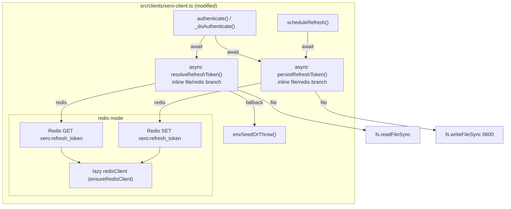
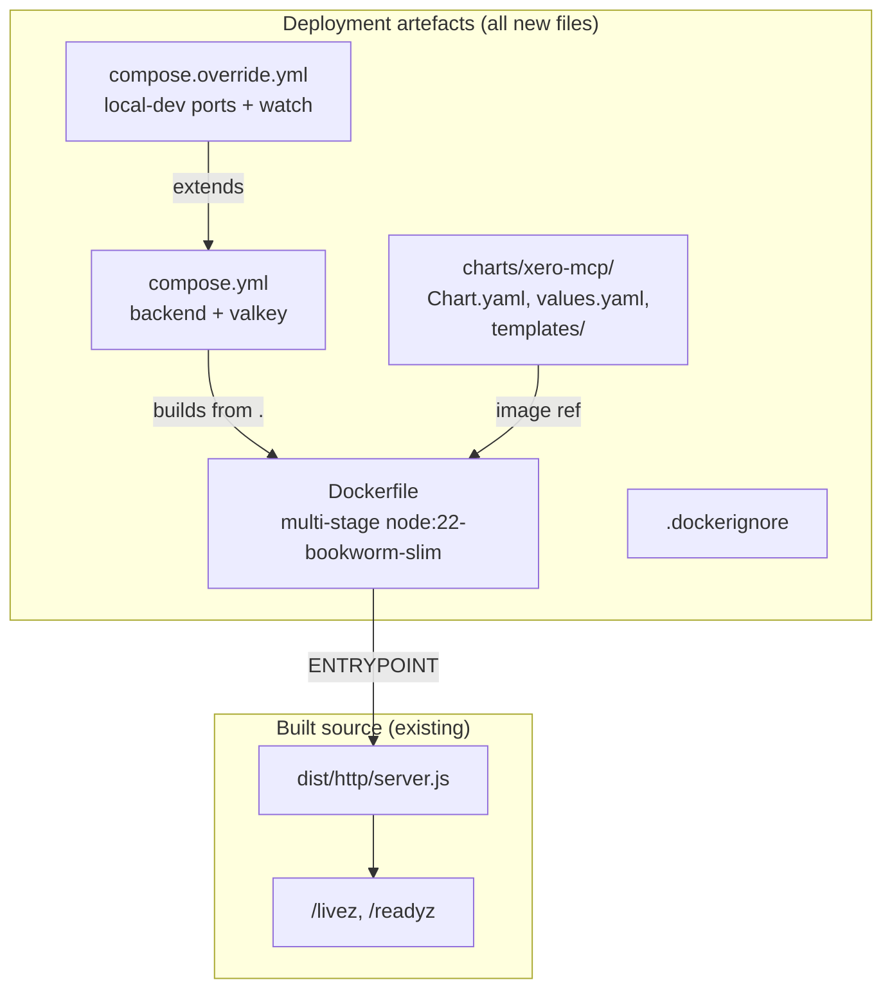

# Design: Deployment Artefacts + Redis Token Persistence
**Layer:** infra
**Status:** Confirmed
**Last updated:** 2026-05-27
**Domain language:** Validated against `.specs/GLOSSARY.md` (additions promoted in step 4b: Token store, XERO_TOKEN_STORE; Token file reconciled).

## Overview

This design covers two clearly separated concerns. **Part A** modifies `src/clients/xero-client.ts` (already fork-owned per ADR-0001) to support an alternative token persistence backend: when `XERO_TOKEN_STORE=redis`, the rotated Xero refresh token is read from and written to a Redis key instead of the filesystem. This removes the need for a PVC in the Kubernetes deployment, keeping pods stateless. File mode remains the default and is behaviourally unchanged. **Part B** adds all deployment artefacts -- Dockerfile, Docker Compose stack, and Helm chart -- to ship the HTTP entry point as a hardened container image with a local-dev stack and a production-ready Helm chart modelled on the cin7-mcp sibling.

## Architecture

The token-store change is a narrow extension to `RefreshTokenXeroClient`. The existing private `resolveRefreshToken()` and `persistRefreshToken()` methods are converted directly to `async` and each gains an inline `if (this.tokenStore === "redis") … else …` branch — file mode runs the original synchronous `fs` logic, redis mode reads/writes the Redis key. There are no separate dispatcher wrappers (the two methods *are* the dispatch points). The shared env-seed fallback ("use `XERO_REFRESH_TOKEN` seed, else throw") is extracted into a private `envSeedOrThrow()` helper used by both branches. Redis mode lazily creates a node-redis client on first use via `ensureRedisClient()`, keeping module-load side-effect-free when `XERO_TOKEN_STORE` is `file` or unset.





### Reuse strategy

- **`redis` npm package (node-redis v4):** Already a dependency (`^4.7.1` in `package.json`). The token store uses the same `createClient` / `connect` pattern as `src/http/server.ts` but creates its own dedicated client instance -- see "Redis client isolation" below.
- **Existing `resolveRefreshToken()` / `persistRefreshToken()` in xero-client.ts:** Converted in place to `async` with an inline file/redis branch; the original synchronous `fs` logic becomes the `file`-mode branch. No wrapper methods are added.
- **Existing test file `src/__tests__/clients/xero-client.test.ts`:** All 17 existing file-mode tests must continue to assert the same behaviour (default mode is `file`); they were updated only to `await` the now-async `resolveRefreshToken`/`persistRefreshToken`. New Redis-mode tests are added in new `describe` sections.
- **cin7-mcp chart structure:** The Helm chart mirrors cin7-mcp's `_helpers.tpl`, `deployment.yaml`, `service.yaml`, `ingress.yaml` shapes, minus `cache`, `rateLimit`, `FASTMCP_HOME`, and PVC concerns.

### Redis client isolation

`xero-client.ts` is a module-level singleton imported by both entry points (`src/index.ts` for stdio, `src/http/server.ts` for HTTP). The HTTP entry already creates a Redis client in `server.ts` for DCR/health, but:

1. The stdio entry has no Redis client and must not create one when `XERO_TOKEN_STORE=file`.
2. Even the HTTP entry's Redis client is created inside `createApp()` after settings are loaded, while `xero-client.ts` is imported at module scope (side-effect: `dotenv.config()` + env guards).

Therefore, `xero-client.ts` creates its own Redis client **lazily** -- only when `XERO_TOKEN_STORE=redis` and only on first call to `resolveRefreshToken()` or `persistRefreshToken()`. The client is stored as a private field on `RefreshTokenXeroClient`. This means the process has two Redis connections when running in HTTP + redis mode (one for DCR/health, one for token persistence). This is acceptable: both are lightweight, long-lived connections to the same `REDIS_URL`, and the alternative (sharing a client) would require passing the Redis client from server.ts into the xero-client singleton, which would break the module-level import pattern used by both entry points.

The lazy client calls `createClient({ url: process.env.REDIS_URL })` and `connect()` inside `ensureRedisClient()`. This method is called at the start of `resolveRefreshToken()` (during `_doAuthenticate`) and is a no-op on subsequent calls. The fail-loud contract (FR-5) is enforced here: if `REDIS_URL` is unset, `ensureRedisClient()` throws immediately; if Redis is unreachable, `connect()` rejects and the error propagates up through `_doAuthenticate()` to crash the process at startup.

### Token-store rationale (FR-17)

**Why Redis over a PVC for deployed mode:**

The Xero refresh token is a single string (~600 bytes) that changes on every token exchange (every ~25 minutes). Persisting it requires:
- **Durability across pod restarts** (a lost token means manual re-seeding from the Xero API Explorer).
- **Availability during RollingUpdate** (both old and new pods must read the latest token).

A `ReadWriteOnce` PVC binds to a single node. During `RollingUpdate`, the new pod may schedule on a different node and fail to mount the PVC, blocking the rollout. `ReadWriteMany` (Azure Files) adds latency, cost, and an infrastructure dependency for 600 bytes of state. Redis (already required for DCR in HTTP mode per ADR-0003) is the right tool: a single `GET`/`SET` on a key, no PVC, no node affinity.

**The `file` default:**

The stdio entry (`dist/index.js`) is used locally with Claude Desktop. It has no Redis dependency and must not acquire one. Defaulting to `file` preserves the existing zero-config local-dev experience.

**No encryption at rest:**

The refresh token is stored as plaintext in Redis, matching the posture of DCR client registrations (ADR-0003). The trade-off is the same: cluster-internal Redis, not internet-exposed; encryption is additive (a wrapper can be inserted later without changing the interface). This is an explicit follow-up, not a deferred decision.

**RollingUpdate rotation-overlap behaviour:**

With `replicaCount: 1` and `strategy.type: RollingUpdate`, there is a brief window during deploys where two pods run simultaneously. Both read the same token from Redis. If both fire their scheduled refresh timer in this overlap:
1. Pod A exchanges the token, gets a new refresh token, writes it to Redis.
2. Pod B (still holding the old refresh token) attempts an exchange. Xero rejects it (the old token was invalidated by A's exchange).
3. Pod B's `scheduleRefresh` catch block calls `process.exit(1)`. Kubernetes restarts Pod B.
4. Pod B reads the latest token from Redis (written by Pod A) and succeeds.

This is self-healing. The `maxUnavailable: 0` / `maxSurge: 1` default for RollingUpdate means the old pod is only terminated after the new pod is Ready, so at most one restart cycle occurs. The `values.yaml` documents this behaviour in a comment on `replicaCount`.

## Data Model

No new database tables. One new Redis key:

| Key | Default | Overridable via | Value | TTL | Purpose |
|---|---|---|---|---|---|
| `xero:refresh_token` | `xero:refresh_token` | `XERO_TOKEN_REDIS_KEY` | The current (most-recently-rotated) Xero refresh token, plaintext | None | Token persistence for Redis mode |

The existing DCR keys (`oauth:clients:{client_id}`) are unaffected. The `xero:` prefix provides namespace separation.

## API / Interface Design

No new API endpoints. The only interface change is to the `RefreshTokenXeroClient` class internals (private methods), which are not part of any public API.

New environment variables:

| Variable | Values | Default | Required when | Purpose |
|---|---|---|---|---|
| `XERO_TOKEN_STORE` | `file` \| `redis` | `file` | Never (optional) | Selects the Token store backend |
| `XERO_TOKEN_REDIS_KEY` | Any string | `xero:refresh_token` | Never (optional) | Overrides the Redis key name |

## ADR Alignment

| ADR | Relationship | Notes |
|---|---|---|
| [0001 -- Refresh Token auth mode](../../adr/0001-refresh-token-auth-mode.md) | **Extend** | Part A extends the refresh-token persistence mechanism from file-only to file-or-Redis. The core auth model (single `RefreshTokenXeroClient`, exchange-rotate-persist-schedule) is unchanged. `xero-client.ts` is already fork-owned per this ADR; the token-store option is a normal evolution, not a new architectural divergence. No standalone ADR warranted (FR-17). |
| [0002 -- MCP HTTP transport and OAuth](../../adr/0002-mcp-http-transport-and-oauth.md) | **Adopt** | Part B's Dockerfile and Helm chart deploy the HTTP entry point designed in ADR-0002. No changes to the HTTP/OAuth model. |
| [0003 -- OAuth state in Redis](../../adr/0003-oauth-state-in-redis.md) | **Adopt** | Part A reuses the same Redis connection pattern (`createClient` + `connect` + `REDIS_URL`) and the same no-encryption-at-rest posture. The `xero:` key prefix avoids collision with the `oauth:clients:` namespace. |

No new ADRs introduced.

## Component Breakdown

### Part A -- Redis token persistence

#### A1. `src/clients/xero-client.ts` -- Token store extension

**Responsibility:** Add conditional Redis-backed token resolve/persist alongside the existing file-based implementation.

**Location:** `src/clients/xero-client.ts` (existing, fork-owned)

**Key changes:**

1. **New private fields on `RefreshTokenXeroClient`:**
   - `private readonly tokenStore: "file" | "redis"` -- read from `process.env.XERO_TOKEN_STORE`, default `"file"`.
   - `private readonly tokenRedisKey: string` -- read from `process.env.XERO_TOKEN_REDIS_KEY`, default `"xero:refresh_token"`.
   - `private tokenRedisClient: ReturnType<typeof createClient> | null = null` -- lazily created.

2. **Private method `ensureRedisClient(): Promise<ReturnType<typeof createClient>>`:**
   - If `this.tokenRedisClient` is not null (already created), return it — created once, reused for the process lifetime.
   - Otherwise: assert `process.env.REDIS_URL` is set (throw `"REDIS_URL is required when XERO_TOKEN_STORE=redis"` if not). Call `createClient({ url: process.env.REDIS_URL })`, `await client.connect()`, store as `this.tokenRedisClient`, return it.
   - The `redis` import is a dynamic `await import("redis")` inside this method to avoid loading the redis module at all in file mode. This keeps file mode completely free of Redis import side-effects at module load.

3. **Private async method `resolveRefreshToken(): Promise<string>`** (converted from sync, inline branching):
   - If `this.tokenStore === "file"`: reads from the token file (trimmed); falls through to `envSeedOrThrow()` if absent.
   - If `this.tokenStore === "redis"`:
     1. `const client = await this.ensureRedisClient()`.
     2. `const token = await client.get(this.tokenRedisKey)`.
     3. If token is non-null and non-empty, return it; else call `envSeedOrThrow()`.

4. **Private async method `persistRefreshToken(token: string): Promise<void>`** (converted from sync, inline branching):
   - If `this.tokenStore === "file"`: writes to the token file with `0600` permissions via tmp+rename.
   - If `this.tokenStore === "redis"`: `const client = await this.ensureRedisClient()`, then `await client.set(this.tokenRedisKey, token)` -- no TTL.

5. **Private helper `envSeedOrThrow(): string`**: returns `process.env.XERO_REFRESH_TOKEN` if set, else throws `"No refresh token found. Set XERO_REFRESH_TOKEN..."`. Eliminates duplication between the file and redis resolve paths.

6. **`_doAuthenticate()` and `scheduleRefresh()`** call `await this.resolveRefreshToken()` and `await this.persistRefreshToken(...)` directly.

7. **Constructor changes:**
   - Read `XERO_TOKEN_STORE` from `process.env` and normalise: `(process.env.XERO_TOKEN_STORE === "redis") ? "redis" : "file"` (any value other than `"redis"` defaults to `"file"`, per FR-1).
   - Read `XERO_TOKEN_REDIS_KEY` with default.

**Impacted callers:** None externally. The public interface of `xeroClient` is unchanged (`authenticate(): Promise<void>`). Both entry points call `await xeroClient.authenticate()` and see no difference.

#### A2. `.env.example` -- Additive update

**Location:** `.env.example` (root)

**Changes:** Append two new entries near the existing `XERO_TOKEN_FILE` block (after line 13, before the OSB HTTP Mode section):

```
# -- Token persistence backend ------------------------------------------------------------------
# Controls where the rotated refresh token is stored.
# "file" (default): writes to XERO_TOKEN_FILE (local/stdio use).
# "redis": writes to a Redis key (deployed/HTTP use; requires REDIS_URL).
# XERO_TOKEN_STORE=file

# Redis key name for the refresh token when XERO_TOKEN_STORE=redis.
# XERO_TOKEN_REDIS_KEY=xero:refresh_token
```

Existing entries remain byte-for-byte identical.

### Part B -- Deployment artefacts

#### B1. `Dockerfile` -- Multi-stage container image

**Responsibility:** Build and package the HTTP entry point into a hardened, non-root container image.

**Location:** `Dockerfile` (repo root)

**Key logic:**

```dockerfile
# ── Builder stage ─────────────────────────────────────────────────────────────
FROM node:22-bookworm-slim AS builder
WORKDIR /app
COPY package.json package-lock.json ./
RUN npm ci
COPY tsconfig.json ./
COPY src/ ./src/
RUN npm run build && npm prune --omit=dev

# ── Runtime stage ─────────────────────────────────────────────────────────────
FROM node:22-bookworm-slim
WORKDIR /app

RUN apt-get update \
 && apt-get upgrade -y --no-install-recommends \
 && rm -rf /var/lib/apt/lists/*

RUN groupadd -g 10001 appgroup \
 && useradd -u 10001 -g appgroup -s /sbin/nologin -M appuser \
 && chown -R appuser:appgroup /app

COPY --from=builder --chown=appuser:appgroup /app/dist ./dist/
COPY --from=builder --chown=appuser:appgroup /app/node_modules ./node_modules/
COPY --from=builder --chown=appuser:appgroup /app/package.json ./

ENV XERO_TOKEN_FILE=/app/.xero-mcp/refresh_token
ENV MCP_BIND_HOST=0.0.0.0
ENV MCP_BIND_PORT=8000

EXPOSE 8000

HEALTHCHECK --interval=10s --timeout=5s --start-period=10s --retries=3 \
    CMD node -e "const http = require('http'); const req = http.get('http://localhost:8000/livez', (res) => { process.exit(res.statusCode === 200 ? 0 : 1); }); req.on('error', () => process.exit(1));"

USER 10001:10001
ENTRYPOINT ["node", "/app/dist/http/server.js"]
```

Design notes:
- `node:22-bookworm-slim` for both stages (same as cin7-mcp's `python:3.13-slim` approach, adapted for Node).
- `npm ci` in builder for reproducible installs; `npm prune --omit=dev` strips devDependencies before copy to runtime.
- `apt-get upgrade -y` in runtime for CVE patches (matches cin7-mcp).
- UID/GID 10001 non-root `appuser:appgroup` (matches cin7-mcp).
- `HEALTHCHECK` uses Node's built-in `http` module (no curl in slim images).
- `XERO_TOKEN_FILE` ENV is set as a harmless default; Redis mode ignores it.
- `readOnlyRootFilesystem` compatibility: the image writes nothing to disk in Redis mode. In file mode (compose local-dev), a bind-mount provides the writable path.

#### B2. `.dockerignore`

**Responsibility:** Exclude non-essential files from the Docker build context.

**Location:** `.dockerignore` (repo root)

```
.git/
.github/
.specs/
.claude/
.vscode/
coverage/
node_modules/
dist/
compose*.yml
charts/
.env*
*.md
.xero-mcp/
```

> `.xero-mcp/` is excluded so a refresh token written by a local `docker compose` run (file mode bind-mount) is never sent to the Docker daemon as build context. It is also git-ignored.

#### B3. `compose.yml` -- Production-like stack

**Responsibility:** Define the two-service stack (backend + valkey) with production-like defaults.

**Location:** `compose.yml` (repo root)

**Key logic:**

```yaml
services:
  valkey:
    image: valkey/valkey:9.0.4
    restart: always
    healthcheck:
      test: ["CMD", "valkey-cli", "ping"]
      interval: 10s
      timeout: 5s
      retries: 5

  backend:
    build:
      context: .
      dockerfile: Dockerfile
    image: xero-mcp:latest
    restart: always
    depends_on:
      valkey:
        condition: service_healthy
    environment:
      - ENVIRONMENT=local
      - REDIS_URL=redis://valkey:6379/0
    env_file:
      - path: .env
        required: false
    healthcheck:
      test:
        [
          "CMD",
          "node",
          "-e",
          "const http = require('http'); const req = http.get('http://localhost:8000/livez', (res) => { process.exit(res.statusCode === 200 ? 0 : 1); }); req.on('error', () => process.exit(1));",
        ]
      interval: 10s
      timeout: 5s
      start_period: 15s
      retries: 5
```

Design notes:
- `valkey:9.0.4` matches cin7-mcp (pinned minor).
- `ENVIRONMENT=local` default so `docker compose up` works with just `.env` credentials (no Entra config needed).
- `REDIS_URL` points at the `valkey` service; `XERO_TOKEN_STORE` is not set here (defaults to `file` for local compose; operator can override in `.env`).
- `env_file` is optional -- compose won't fail if `.env` is absent, but the backend's own env guards will throw at startup with clear messages.
- Health check uses the same Node one-liner as the Dockerfile (no curl).

#### B4. `compose.override.yml` -- Local-dev overrides

**Responsibility:** Local-dev conveniences: port publishing, bind-mount for token file persistence, file-watch rebuild.

**Location:** `compose.override.yml` (repo root)

```yaml
services:
  backend:
    restart: "no"
    ports:
      - "8000:8000"
    volumes:
      - ./.xero-mcp:/app/.xero-mcp
    develop:
      watch:
        - path: ./src
          action: rebuild
        - path: ./package.json
          action: rebuild
```

Design notes:
- `restart: "no"` overrides production `always` -- crash-on-error is the correct local-dev behaviour (fail-loud).
- Port `8000:8000` published for `curl http://localhost:8000/livez`.
- Bind-mount `./.xero-mcp:/app/.xero-mcp` so the file-mode rotated token survives `docker compose down`. The host directory is created automatically by Docker Compose if absent.
- `develop.watch` on `./src` and `./package.json` triggers rebuild (the image runs the compiled `dist/`, so source changes need a full rebuild).

#### B5. `charts/xero-mcp/Chart.yaml`

**Location:** `charts/xero-mcp/Chart.yaml`

```yaml
apiVersion: v2
name: xero-mcp
description: MCP server that wraps the Xero accounting/payroll API.
version: 0.0.0
appVersion: "0.0.0"
```

#### B6. `charts/xero-mcp/.helmignore`

**Location:** `charts/xero-mcp/.helmignore`

Verbatim copy of cin7-mcp's `.helmignore`.

#### B7. `charts/xero-mcp/templates/_helpers.tpl`

**Location:** `charts/xero-mcp/templates/_helpers.tpl`

Same `backend.name`, `backend.fullname`, `backend.labels`, `backend.selectorLabels` helpers as cin7-mcp, with `xero-mcp` as the chart name.

#### B8. `charts/xero-mcp/templates/deployment.yaml`

**Responsibility:** Deployment manifest for the HTTP server pod.

**Location:** `charts/xero-mcp/templates/deployment.yaml`

**Key logic:**

- `replicas: {{ .Values.replicaCount }}` (default 1). Comment explaining the token-rotation rationale and RollingUpdate overlap behaviour.
- `strategy.type: RollingUpdate` pinned with `rollingUpdate: { maxUnavailable: 0, maxSurge: 1 }`, so the old pod is only terminated once the new pod is Ready (bounds the token-rotation overlap window; comment notes raising `maxSurge`/`replicaCount` widens it but stays self-healing).
- `imagePullSecrets` passthrough via `{{- with .Values.imagePullSecrets }}` under the pod `spec` (private ACR registry).
- Pod `securityContext`: `runAsUser: 10001`, `runAsGroup: 10001`, `runAsNonRoot: true`.
- Container `securityContext`: `readOnlyRootFilesystem: true`, `allowPrivilegeEscalation: false`, `capabilities.drop: [ALL]`.
- `volumes`: `tmp` emptyDir. Plus `extraVolumes` passthrough.
- `volumeMounts`: `/tmp` from `tmp`. Plus `extraVolumeMounts` passthrough.
- `livenessProbe` on `/livez`, `readinessProbe` on `/readyz`, timings from `.Values.probes.*`.
- `containerPort: {{ .Values.service.port }}`.
- `envFrom.secretRef` when `.Values.envFrom.secretRef.name` is set -- the secret provides `XERO_CLIENT_ID`, `XERO_CLIENT_SECRET`, `XERO_REFRESH_TOKEN`, `ENTRA_TENANT_ID`, `ENTRA_CLIENT_ID`, `REDIS_URL`, `DEV_BEARER_TOKEN`, etc.
- Free-form `.Values.env` map emitted first (so chart-managed keys win on duplicate-key resolution).
- Chart-managed env (emitted last):
  - `XERO_TOKEN_STORE=redis` (always; the chart is for deployed mode).
  - `MCP_SERVER_URL` from `.Values.auth.publicUrl` (when set).
  - `ENTRA_REQUIRED_SCOPES` from `.Values.auth.requiredScopes` (when set).
- **No** `CACHE_TTL_SECONDS`, `*_RATE_LIMIT_*`, `FASTMCP_HOME`, or PVC volume.
- `nodeSelector` passthrough.

#### B9. `charts/xero-mcp/templates/service.yaml`

**Location:** `charts/xero-mcp/templates/service.yaml`

Verbatim shape from cin7-mcp: ClusterIP Service on `.Values.service.port`, selector via `backend.selectorLabels`.

#### B10. `charts/xero-mcp/templates/ingress.yaml`

**Location:** `charts/xero-mcp/templates/ingress.yaml`

Same guard-and-render pattern as cin7-mcp:
- `{{- if .Values.ingress.enabled }}` gate.
- `{{- if not .Values.ingress.host }}{{ fail "ingress.enabled is true but ingress.host is empty..." }}{{- end }}` guard.
- `ingressClassName: tailscale`, annotation `tailscale.com/funnel: "true"`.
- Host from `.Values.ingress.host`, TLS with `.Values.ingress.tls.secretName`.

#### B11. `charts/xero-mcp/values.yaml`

**Location:** `charts/xero-mcp/values.yaml`

```yaml
replicaCount: 1    # See deployment.yaml comments for token-rotation rationale

image:
  repository: oldschoolbrand.azurecr.io/xero-mcp/backend
  tag: ""
  pullPolicy: IfNotPresent

# Pull secrets for the private ACR registry. Operators supply e.g.
# [{ name: acr-cred }]; the deployment template emits them via a
# {{- with .Values.imagePullSecrets }} passthrough.
imagePullSecrets: []

service:
  type: ClusterIP
  port: 8000

resources:
  requests:
    cpu: 100m
    memory: 384Mi
  limits:
    cpu: 500m
    memory: 1Gi

envFrom:
  secretRef:
    name: ""

auth:
  publicUrl: ""
  requiredScopes: ""

env: {}

ingress:
  enabled: false
  host: ""
  tls:
    secretName: ""

probes:
  liveness:
    initialDelaySeconds: 5
    periodSeconds: 10
    timeoutSeconds: 2
    failureThreshold: 3
    successThreshold: 1
  readiness:
    initialDelaySeconds: 3
    periodSeconds: 10
    timeoutSeconds: 2
    failureThreshold: 3
    successThreshold: 1

extraVolumes: []
extraVolumeMounts: []
nodeSelector: {}
```

No `cache`, `rateLimit`, `tokenPersistence`, or PVC-related keys. `XERO_TOKEN_STORE=redis` is a chart-managed env in the deployment template, not a values.yaml key (it is not operator-configurable; the chart always sets it).

## Error Handling & Edge Cases

### Part A

| Failure mode | Response | FR/AC |
|---|---|---|
| `XERO_TOKEN_STORE=redis`, `REDIS_URL` unset | Throw at startup: `"REDIS_URL is required when XERO_TOKEN_STORE=redis"` | FR-5, AC-5 |
| `XERO_TOKEN_STORE=redis`, Redis unreachable at startup | `ensureRedisClient()` rejects; error propagates through `_doAuthenticate()` to crash the process | FR-5 |
| `XERO_TOKEN_STORE=redis`, Redis key absent, `XERO_REFRESH_TOKEN` set | Uses env seed for first exchange; writes rotated token to Redis key | FR-3, AC-3 |
| `XERO_TOKEN_STORE=redis`, Redis key absent, `XERO_REFRESH_TOKEN` unset | Throws with guidance message (same text as file-mode) | FR-3 |
| `XERO_TOKEN_STORE=redis`, scheduled refresh fails | `process.exit(1)` (unchanged behaviour) | FR-6 |
| `XERO_TOKEN_STORE=redis`, Redis write fails during persist | Error propagates to `scheduleRefresh` catch -> `process.exit(1)` | FR-4 |
| `XERO_TOKEN_STORE=file` (or unset) | Existing file-mode behaviour, byte-for-byte unchanged | FR-2, AC-1 |

### Part B

| Failure mode | Response |
|---|---|
| Docker build fails | Exit non-zero with build error; no runtime impact |
| Compose backend starts before valkey is healthy | `depends_on: valkey: condition: service_healthy` prevents this |
| Helm template with `ingress.enabled=true` but no `ingress.host` | Template fails with a clear error message |
| Missing secret ref at deploy time | Pod fails to start; Kubernetes events name the missing secret |

## Security & Permissions

- **Token file `0600` permissions:** Preserved exactly in file mode (FR-2).
- **Redis token plaintext:** Same posture as DCR state (ADR-0003). Cluster-internal Redis. Encryption at rest is a tracked follow-up.
- **Container non-root:** UID 10001, `readOnlyRootFilesystem`, drop ALL capabilities, `allowPrivilegeEscalation: false`.
- **No secrets in Dockerfile:** All credentials come from env vars / Kubernetes secrets.
- **`.dockerignore` excludes `.env*`:** Prevents credential leakage into the build context.
- **`REDIS_URL` may contain credentials:** The existing `safeRedisUrl()` helper in `server.ts` strips credentials before logging. The token-store code in `xero-client.ts` does not log `REDIS_URL` (it only throws a message naming `REDIS_URL` as the env var, not its value).

## Performance Considerations

- **Redis round-trips for token ops:** One `GET` at startup, one `SET` per token rotation (~every 25 minutes). Negligible.
- **Lazy Redis client:** No connection overhead at module load. File mode has zero Redis cost.
- **Dynamic `import("redis")`:** The `redis` module is only loaded when `XERO_TOKEN_STORE=redis`. In file mode, the module is never loaded, keeping startup fast and memory lean for stdio use.
- **Two Redis connections in HTTP+Redis mode:** Acceptable; both are lightweight TCP connections. No connection pooling needed at this scale.
- **Docker image size:** `node:22-bookworm-slim` + `npm prune --omit=dev` minimises runtime image size. No dev tooling in the runtime stage.

## Dependencies

### Internal

| Module | Impact | Notes |
|---|---|---|
| `src/clients/xero-client.ts` | Modified | Fork-owned (ADR-0001). Only file touched in `src/`. |
| `src/http/server.ts` | Not modified | Already imports `xeroClient`; no code changes needed. |
| `src/__tests__/clients/xero-client.test.ts` | Extended | New tests added for Redis mode; existing tests unchanged. |

### External

| Package | Version | Status | Purpose |
|---|---|---|---|
| `redis` | ^4.7.1 | Already installed | Token persistence (Redis mode); also used by DCR store and health. |
| `node:fs`, `node:os`, `node:path` | built-in | Already used | File-mode token ops (unchanged). |

### New tools (verification-only, not runtime)

| Tool | Purpose |
|---|---|
| `docker` | Build and smoke-test the image |
| `docker compose` | Run the local stack |
| `helm` | Lint and template the chart |

## Testing Strategy

This feature has a **hybrid** testing strategy spanning two modes because it contains two clearly distinct component types.

### Part A -- Redis token persistence (`full-tdd`)

**Mode:** full-tdd
**Rationale:** The token-store selector introduces conditional runtime behaviour (async Redis I/O, lazy client creation, env-based dispatch) inside the auth-critical `xero-client.ts`. The file-mode regression risk and the Redis-mode failure modes all require assertion-level verification with mocked externals.
**Framework:** Vitest 4.x (already configured in `package.json`; `vitest run` discovers `*.test.ts` under `src/`).
**Test location:** `src/__tests__/clients/xero-client.test.ts` (existing file, extended with new `describe` sections for Redis mode).
**Commands:**
  - Run:      `npx vitest run src/__tests__/clients/xero-client.test.ts`
  - Coverage: `npx vitest run --coverage src/__tests__/clients/xero-client.test.ts`
**Done when:** All tests green (existing 17 file-mode tests + new Redis-mode tests). No regressions.

**Mocking strategy for Redis mode tests:**
- Mock the `redis` module via `vi.mock("redis")` to return a fake `createClient` that returns an object with `connect: vi.fn()`, `get: vi.fn()`, `set: vi.fn()`, `isReady: true`.
- Control the mock's return values per test to simulate: key present, key absent, connection failure, `REDIS_URL` unset.
- The dynamic `import("redis")` in `ensureRedisClient()` will resolve to the mocked module.
- `vi.stubEnv("XERO_TOKEN_STORE", "redis")` and `vi.stubEnv("REDIS_URL", "redis://localhost:6379/0")` to activate Redis mode.
- Existing file-mode tests must pass unchanged with `XERO_TOKEN_STORE` unset (default `file`).

### Part B -- Deployment artefacts (`verification-only`)

**Mode:** verification-only
**Rationale:** Dockerfile, Docker Compose, and Helm chart are declarative configuration. Correctness is verified by the build tools themselves (`docker build`, `docker compose up`, `helm lint`, `helm template`), not by unit tests.
**Verification commands (in order):**
  1. `docker build -t xero-mcp:test .` -- exits 0; image builds successfully.
  2. `docker compose up --build -d && sleep 5 && curl -fsS http://localhost:8000/livez && docker compose down` -- stack boots; `/livez` returns 200.
  3. `helm lint charts/xero-mcp` -- no errors.
  4. `helm template xero-mcp charts/xero-mcp --set envFrom.secretRef.name=xero-secrets --set auth.publicUrl=https://x/ --set auth.requiredScopes=mcp` -- renders valid YAML with expected structure.
  5. `helm template xero-mcp charts/xero-mcp --set ingress.enabled=true --set ingress.host=xero.tail.ts.net` -- renders Ingress with `ingressClassName: tailscale`.
  6. `helm template xero-mcp charts/xero-mcp --set ingress.enabled=true 2>&1 | grep -q "ingress.host is empty"` -- fails with guard message when host is empty.
  7. `helm template xero-mcp charts/xero-mcp | grep -qv PersistentVolumeClaim` -- no PVC in rendered output.
**Done when:** All commands exit 0 with no errors or unexpected diffs.

## Examples

Examples are derived from Part A acceptance criteria (full-tdd mode). Part B (verification-only) does not require examples -- the verification commands above are the acceptance bar.

**Example 1 -- File mode is the default and unchanged (happy path)**
- Given: `XERO_TOKEN_STORE` is unset, `XERO_TOKEN_FILE` set to `/tmp/test-xero-token`, file contains `rt_file_existing_001`, `XERO_CLIENT_ID=ABC123`, `XERO_CLIENT_SECRET=DEF456`
- When: `authenticate()` is called and later a scheduled token rotation occurs
- Then: `resolveRefreshToken()` returns `rt_file_existing_001` (from file); `persistRefreshToken()` calls `fs.writeFileSync` with `0600` permissions; no Redis `createClient` is called; no Redis `get` or `set` is called
- AC: AC-1

**Example 2 -- File mode: unset XERO_TOKEN_STORE defaults to file**
- Given: `XERO_TOKEN_STORE` is `""` (empty string), `XERO_REFRESH_TOKEN=rt_env_seed_002`
- When: a fresh client is created
- Then: `tokenStore` field is `"file"`; `resolveRefreshToken()` goes through the file path (readFileSync called, falls back to env seed)
- AC: AC-1

**Example 3 -- Redis mode resolves from the Redis key**
- Given: `XERO_TOKEN_STORE=redis`, `REDIS_URL=redis://localhost:6379/0`, the Redis mock's `get("xero:refresh_token")` returns `"rt_redis_stored_001"`
- When: `resolveRefreshToken()` is called during `authenticate()`
- Then: returns `"rt_redis_stored_001"`; does not read `process.env.XERO_REFRESH_TOKEN`; does not call `fs.readFileSync`
- AC: AC-2

**Example 4 -- Redis mode seeds from env when key absent**
- Given: `XERO_TOKEN_STORE=redis`, `REDIS_URL=redis://localhost:6379/0`, the Redis mock's `get("xero:refresh_token")` returns `null`, `XERO_REFRESH_TOKEN=rt_env_seed_003`
- When: `resolveRefreshToken()` is called during `authenticate()`; Xero exchange succeeds with `refresh_token: "rt_rotated_003"`
- Then: returns `"rt_env_seed_003"` for the exchange; `persistRefreshToken()` calls `redis.set("xero:refresh_token", "rt_rotated_003")` with no TTL; `fs.writeFileSync` is not called
- AC: AC-3

**Example 5 -- Redis mode persists rotations to Redis, not file**
- Given: `XERO_TOKEN_STORE=redis`, `REDIS_URL=redis://localhost:6379/0`, server is running, a scheduled token rotation fires, exchange returns `refresh_token: "rt_rotated_004"`
- When: `persistRefreshToken("rt_rotated_004")` is called inside `scheduleRefresh()`
- Then: `redis.set("xero:refresh_token", "rt_rotated_004")` is called; `fs.writeFileSync` is not called; `fs.renameSync` is not called
- AC: AC-4

**Example 6 -- Redis mode fail-loud without REDIS_URL**
- Given: `XERO_TOKEN_STORE=redis`, `REDIS_URL` is unset (empty)
- When: `authenticate()` is called (which calls `resolveRefreshToken()` which calls `ensureRedisClient()`)
- Then: throws with message containing `"REDIS_URL is required when XERO_TOKEN_STORE=redis"`
- AC: AC-5

**Example 7 -- Redis mode fail-loud when Redis unreachable**
- Given: `XERO_TOKEN_STORE=redis`, `REDIS_URL=redis://localhost:6379/0`, the Redis mock's `connect()` rejects with `Error("Connection refused")`
- When: `authenticate()` is called
- Then: the error propagates; `_doAuthenticate()` does not catch it; the process crashes (in the HTTP entry, `server.ts`'s catch block calls `process.exit(1)`)
- AC: AC-5 (unreachable variant)

**Example 8 -- Redis mode with custom key name**
- Given: `XERO_TOKEN_STORE=redis`, `REDIS_URL=redis://localhost:6379/0`, `XERO_TOKEN_REDIS_KEY=custom:token:key`, the Redis mock's `get("custom:token:key")` returns `"rt_custom_key_001"`
- When: `resolveRefreshToken()` is called
- Then: `redis.get` is called with `"custom:token:key"` (not the default `"xero:refresh_token"`); returns `"rt_custom_key_001"`
- AC: AC-2 (custom key variant)

**Example 9 -- Redis mode: key absent and env seed absent throws with guidance**
- Given: `XERO_TOKEN_STORE=redis`, `REDIS_URL=redis://localhost:6379/0`, the Redis mock's `get("xero:refresh_token")` returns `null`, `XERO_REFRESH_TOKEN` is unset
- When: `resolveRefreshToken()` is called
- Then: throws with message matching `/XERO_REFRESH_TOKEN.*api-explorer\.xero\.com/`
- AC: AC-3 (no-seed failure variant)

**Example 10 -- File mode tests still pass (regression guard)**
- Given: `XERO_TOKEN_STORE` is unset, all existing test setup from `xero-client.test.ts` sections 1-6
- When: `npx vitest run src/__tests__/clients/xero-client.test.ts` is executed
- Then: all 17 existing tests pass; no test is modified
- AC: AC-1 (regression)

**Example 11 -- Scheduled refresh in Redis mode calls process.exit(1) on failure**
- Given: `XERO_TOKEN_STORE=redis`, `REDIS_URL=redis://localhost:6379/0`, server authenticated, a scheduled refresh fires, `exchangeToken` rejects
- When: the `setTimeout` callback runs
- Then: `process.exit(1)` is called (same as file mode)
- AC: AC-4 (failure path)

## Open Questions

None -- all design decisions resolved. The token-store rationale is captured in the Architecture section above per FR-17.
