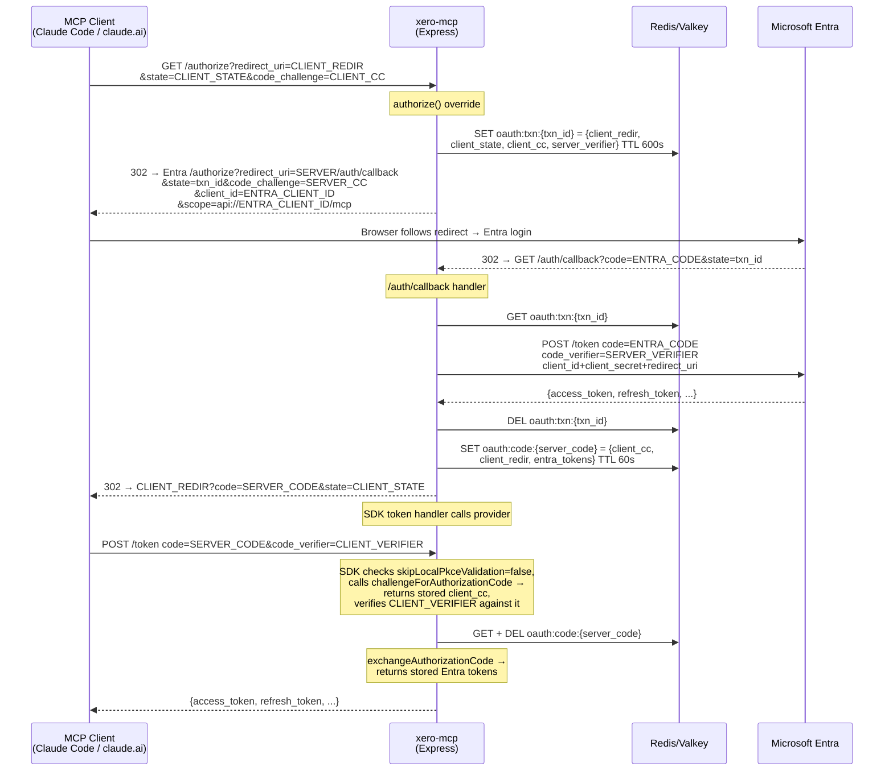

# Design: OAuth-Proxy Bridge for Entra (MCP HTTP auth)
**Layer:** backend
**Status:** Confirmed
**Last updated:** 2026-07-05
**Domain language:** Validated against `.specs/GLOSSARY.md` (additions promoted in step 4b).

## Overview

Replace the current `EntraProxyOAuthServerProvider` (a dumb-forward subclass that leaks the MCP
client's `redirect_uri` to Entra, causing public/confidential client-type mismatches) with an
**OAuth-proxy bridge** that terminates the Entra authorization-code flow at the server's own fixed
`{MCP_SERVER_URL}/auth/callback`. The bridge stores the MCP client's redirect, state, and PKCE
challenge in a short-lived Redis transaction, performs the entire Entra exchange server-side using a
single confidential identity, mints a single-use server authorization code bound to the client's
PKCE challenge and the resulting Entra tokens, then redirects the browser back to the MCP client
with that server code and the client's original state. The MCP SDK's existing `/token` handler
validates the client's PKCE and calls our `exchangeAuthorizationCode` to return the stored Entra
tokens.

This mirrors the algorithm of FastMCP's `OAuthProxy._handle_idp_callback`, adapted to the MCP TS
SDK's `OAuthServerProvider` interface and stripped of everything we do not need (JWT minting, JTI
indirection, consent UI, upstream refresh machinery). The result is a minimal subclass of
`ProxyOAuthServerProvider` (~100-120 LOC of substantive logic across all new/modified files,
excluding tests, imports, and type declarations — see the LOC accounting note under Component Breakdown).

## Architecture

The bridge sits inside `src/http/auth/` alongside the existing `EntraVerifier` and
`RedisOAuthClientsStore`. It replaces `EntraProxyOAuthServerProvider` entirely. The
`EntraVerifier` and `RedisOAuthClientsStore` are unchanged. The only touchpoint outside
`src/http/auth/` is `src/http/server.ts`, which gains a single `GET /auth/callback` Express
route mounted alongside `mcpAuthRouter`.



### What is reused without modification

- **`EntraVerifier`** (`src/http/auth/entra-verifier.ts`) -- unchanged. `verifyAccessToken` still
  validates Entra JWTs by issuer, audience, and scope. The bridge passes Entra tokens through
  to the client, so the verifier continues to work as-is.
- **`RedisOAuthClientsStore`** (`src/http/auth/redis-clients-store.ts`) -- unchanged. DCR
  registration and client lookup are unaffected by the bridge.
- **`LocalBearerVerifier`** (`src/http/auth/local-verifier.ts`) -- unchanged. The bridge exists
  only in the non-local branch of `buildAuth`.
- **`mcpAuthRouter`** from the SDK -- unchanged. It continues to mount `/authorize`, `/token`,
  `/register`, and discovery endpoints. The bridge's `authorize` override is called by the
  router's `/authorize` handler; `challengeForAuthorizationCode` and `exchangeAuthorizationCode`
  are called by the router's `/token` handler.
- **`ProxyOAuthServerProvider.exchangeRefreshToken`** -- inherited. The bridge overrides
  `exchangeRefreshToken` only to substitute the Entra client identity (same as the old
  `EntraProxyOAuthServerProvider` did), reusing the parent's HTTP call to Entra.
- **`ProxyOAuthServerProvider.verifyAccessToken`** -- inherited unchanged (delegates to
  `EntraVerifier`).
- **`ProxyOAuthServerProvider.revokeToken`** -- inherited (not configured, remains undefined).

### What is being replaced

- **`EntraProxyOAuthServerProvider`** class in `src/http/auth/build.ts` -- deleted entirely. Its
  `toEntraClient()` rewrite-and-forward pattern and the per-client-secret guard are the root
  cause of the problem. Replaced by `EntraBridgeProvider`.

### What is being added

- **`EntraBridgeProvider`** -- new class in `src/http/auth/bridge-provider.ts`, subclassing
  `ProxyOAuthServerProvider`. Overrides `authorize`, `challengeForAuthorizationCode`, and
  `exchangeAuthorizationCode`. Sets `skipLocalPkceValidation = false`.
- **`RedisOAuthCodeStore`** -- new class in `src/http/auth/redis-code-store.ts`. A small
  namespaced key-value store for transactions and server codes using the same narrow
  Redis interface pattern as `RedisOAuthClientsStore` (`{ get, set, del, getDel }`).
- **`createCallbackHandler`** -- new factory in `src/http/auth/callback-handler.ts` producing the
  `GET /auth/callback` Express handler.
- **`GET /auth/callback`** route -- mounted in `src/http/server.ts` alongside
  `mcpAuthRouter` in the non-local branch.

### What is being modified

- **`buildAuth()`** in `src/http/auth/build.ts` -- the non-local branch changes to instantiate
  `EntraBridgeProvider` instead of `EntraProxyOAuthServerProvider`. `ENTRA_CLIENT_SECRET`
  becomes required (non-optional) because the bridge always uses a confidential upstream flow.
  The `buildAuth` function also now returns the callback handler alongside the provider.
- **`settings.ts`** -- `ENTRA_CLIENT_SECRET` moves from optional to required in non-local mode
  (`nonLocalRequired` array gains `"ENTRA_CLIENT_SECRET"`). The `NonLocalSettings` type gains a
  non-optional `ENTRA_CLIENT_SECRET: string`.
- **`server.ts`** -- mounts `GET /auth/callback` route using the handler returned by `buildAuth`.
- **Existing tests** -- `entra-proxy-provider.test.ts` is replaced by `bridge-provider.test.ts`.
  `build.test.ts` is updated for the new provider and required `ENTRA_CLIENT_SECRET`.
  `settings.test.ts` is updated for the new required field.

## Data Model

### Redis transaction record (`oauth:txn:<txn_id>`)

| Field                | Type     | Description                                              |
|----------------------|----------|----------------------------------------------------------|
| `clientRedirectUri`  | `string` | The MCP client's `redirect_uri` (where to send the code) |
| `clientState`        | `string` | The MCP client's `state` parameter (opaque, passed back)  |
| `clientCodeChallenge`| `string` | The MCP client's PKCE `code_challenge` (S256)            |
| `serverCodeVerifier` | `string` | The server's own PKCE `code_verifier` for the Entra leg  |

> The client's requested `scopes` are intentionally **not** stored. The upstream Entra scope is
> always the fixed `api://<ENTRA_CLIENT_ID>/mcp`, and the client's requested scope is never echoed
> back, so storing it would be write-only residue (YAGNI). Discovery still advertises
> `scopes_supported: ["mcp"]` unchanged.

- **Key format:** `oauth:txn:<txn_id>` where `txn_id` is `crypto.randomBytes(32).toString('base64url')`
- **TTL:** 600 seconds (10 minutes -- enough for the user to complete Entra login)
- **Serialisation:** JSON via `JSON.stringify`/`JSON.parse`

### Redis server-code record (`oauth:code:<code>`)

| Field                | Type         | Description                                             |
|----------------------|--------------|---------------------------------------------------------|
| `clientCodeChallenge`| `string`     | The MCP client's PKCE `code_challenge` (for SDK PKCE)   |
| `clientRedirectUri`  | `string`     | The MCP client's `redirect_uri` (for SDK redirect check)|
| `tokens`             | `OAuthTokens`| The Entra token set (access_token, refresh_token, etc.) |

- **Key format:** `oauth:code:<code>` where `code` is `crypto.randomBytes(32).toString('base64url')`
- **TTL:** 60 seconds (the client should redeem immediately)
- **Single-use:** `exchangeAuthorizationCode` consumes the key with a single atomic Redis `GETDEL`
  (`codeStore.getAndDelete`), so two concurrent redemptions cannot both succeed (AC 4 holds under
  concurrency). `challengeForAuthorizationCode` only *peeks* the key (the SDK calls it first, then
  `exchangeAuthorizationCode`) — see ADR-0004 Consequences for why the peek is an accepted trade-off.

### TypeScript types

```typescript
interface OAuthTransaction {
  clientRedirectUri: string;
  clientState: string;
  clientCodeChallenge: string;
  serverCodeVerifier: string;
}

interface OAuthServerCode {
  clientCodeChallenge: string;
  clientRedirectUri: string;
  tokens: OAuthTokens;
}
```

## API / Interface Design

No new externally-advertised API endpoints. The `/auth/callback` route is server-internal (not
advertised in `/.well-known/oauth-authorization-server`). It is a standard OAuth callback that
receives `code` and `state` query parameters from Entra and issues a `302` redirect.

### `GET /auth/callback`

**Query parameters (from Entra):**

| Param   | Required | Description                       |
|---------|----------|-----------------------------------|
| `code`  | Yes*     | The authorization code from Entra |
| `state` | Yes      | The `txn_id` sent as upstream state |
| `error` | No       | OAuth error code (if Entra denied) |
| `error_description` | No | Human-readable error detail |

*Either `code` or `error` will be present.

**Success response:** `302` redirect to the stored `clientRedirectUri` with
`?code=<server_code>&state=<client_state>`.

**Error responses:**

| Condition                      | Status | Body (JSON)                                    |
|--------------------------------|--------|-------------------------------------------------|
| Missing `state` parameter      | 400    | `{ error: "invalid_request", error_description }` |
| Unknown/expired `txn_id`       | 400    | `{ error: "invalid_request", error_description }` |
| Entra `error` parameter present| 502    | `{ error: "upstream_error", error_description }`  |
| Entra token exchange fails     | 502    | `{ error: "upstream_error", error_description }`  |

Error responses are plain JSON -- never a redirect to the client's URI when the request is
invalid, to prevent redirecting to an attacker-influenced URI with an error that leaks
information.

## ADR Alignment

- **ADR-0002 (MCP HTTP transport and OAuth model)** -- **Supersede** (partial). ADR-0002's
  decision point 2 states that `ProxyOAuthServerProvider` "proxies `/authorize` and `/token`
  to Entra." The bridge changes this: `/authorize` no longer proxies transparently but stores
  a transaction and constructs the upstream request independently; `/token` no longer proxies
  to Entra but returns locally-stored Entra tokens. The transport (decision 1), Express version
  (decision 4), upstream isolation (decision 5), local auth (decision 3), and discovery surface
  are unchanged. A new **ADR-0004** is warranted, marked `Supersedes: 0002 (decision 2 only)`.
  ADR-0002 itself remains `Accepted` because decisions 1, 3, 4, 5 still hold; only the OAuth
  handshake model changes.

- **ADR-0003 (OAuth state in Redis)** -- **Extend**. ADR-0003 established the `oauth:` key
  prefix and the narrow `{ get, set }` Redis interface for DCR client records. The bridge adds
  two new key namespaces (`oauth:txn:*` and `oauth:code:*`) under the same prefix, using the
  same narrow-interface pattern extended with `del` (for single-use code consumption). The
  `RedisOAuthCodeStore` follows the same design as `RedisOAuthClientsStore`.

- **ADR-0001 (Refresh Token auth mode)** -- No overlap. Unaffected.

### Draft ADR-0004

A new ADR (`0004-oauth-proxy-bridge.md`) will be drafted alongside this design, recording:
- The move from dumb-forward proxy to the OAuth-proxy bridge
- Why: client-type leakage causing loopback auth failures
- The two-PKCE-pair security model
- That ADR-0002 decision 2 is superseded; all other ADR-0002 decisions remain in force

The ADR will be written as `Status: Draft` and promoted to `Accepted` when the user confirms.

## Component Breakdown

> **LOC accounting (AC 7).** The `≤ ~100 LOC (target 50-100)` budget counts substantive production
> lines — excluding imports, blank lines, type/interface declarations, and the deleted
> `EntraProxyOAuthServerProvider`. The realistic sum across the three new files
> (`bridge-provider.ts` ~50-60, `redis-code-store.ts` ~20-30, `callback-handler.ts` ~30-40) lands
> around **100-120** given the callback handler's four security-required error branches; the `~`
> covers this. The goal is "no bulk, no cleverness," not a hard integer wall — do **not** drop error
> handling, logging, or type safety to hit a number. Tasks 2.6 / 5.1 verify the code stays lean, not
> that it hits an exact count.

### 1. `EntraBridgeProvider` (new: `src/http/auth/bridge-provider.ts`)

- **Responsibility:** Subclass of `ProxyOAuthServerProvider` that implements the OAuth-proxy
  bridge pattern. Owns the `authorize` → store-txn → redirect-to-Entra flow and the
  `exchangeAuthorizationCode` → return-stored-tokens flow.
- **Location:** `src/http/auth/bridge-provider.ts`
- **LOC budget:** ~50-60 lines (the class body, excluding imports and types)
- **Key logic:**

  **`constructor(options, codeStore, entraConfig)`** -- Calls `super(options)`. Sets
  `this.skipLocalPkceValidation = false` (the SDK will call `challengeForAuthorizationCode`
  and validate the client's PKCE locally). Stores `codeStore` and Entra config (client ID,
  client secret, server callback URL, fully-qualified scope).

  **`authorize(client, params, res)`** override:
  1. Generate `txn_id` = `crypto.randomBytes(32).toString('base64url')`.
  2. Generate server PKCE pair: `serverVerifier` = `crypto.randomBytes(32).toString('base64url')`,
     `serverChallenge` = `base64url(sha256(serverVerifier))`.
  3. Store `OAuthTransaction` in Redis under `oauth:txn:<txn_id>` with 600s TTL.
  4. Construct Entra authorize URL with: `client_id=ENTRA_CLIENT_ID`,
     `redirect_uri={MCP_SERVER_URL}/auth/callback`, `state=txn_id`,
     `code_challenge=serverChallenge`, `code_challenge_method=S256`,
     `scope=api://{ENTRA_CLIENT_ID}/mcp`, `response_type=code`.
     No `resource` parameter (Entra v2.0 does not support RFC 8707).
  5. `res.redirect(url)`.

  **`challengeForAuthorizationCode(_client, authorizationCode)`** override:
  1. Peek `oauth:code:<authorizationCode>` from Redis with
     `codeStore.get("code", authorizationCode)` (return type inferred as `OAuthServerCode |
     undefined`; read only — the SDK calls this *before* `exchangeAuthorizationCode`, which
     consumes the code).
  2. Return `codeRecord.clientCodeChallenge`.
  3. If not found, throw `InvalidGrantError` (imported from
     `@modelcontextprotocol/sdk/server/auth/errors.js`) so the SDK returns HTTP 400 `invalid_grant`.
     (`ServerError` would map to HTTP 500 `server_error` — wrong per FR-7.)

  **`exchangeAuthorizationCode(client, authorizationCode)`** override:
  1. Consume `oauth:code:<authorizationCode>` with `codeStore.getAndDelete` — a single atomic Redis
     `GETDEL`, so a concurrent replay cannot also read it (AC 4).
  2. If not found (already consumed or expired), throw `InvalidGrantError` → HTTP 400 `invalid_grant`.
  3. Return `codeRecord.tokens`.
  4. The `codeVerifier`, `redirectUri`, and `resource` parameters from the SDK are ignored
     (PKCE was already validated by the SDK before this method is called; the redirect was
     checked when the code was issued).

  **`exchangeRefreshToken(client, refreshToken, scopes, resource)`** override:
  1. Substitute `client.client_id` → `ENTRA_CLIENT_ID`, `client.client_secret` →
     `ENTRA_CLIENT_SECRET`, `scopes` → `[api://{ENTRA_CLIENT_ID}/mcp]`, and drop `resource`.
  2. Call `super.exchangeRefreshToken(entraClient, refreshToken, entraScopes)`.
  3. **Intentional behavioural change from the old provider:** the old
     `EntraProxyOAuthServerProvider.exchangeRefreshToken` also passed `this.entraResource` as the
     fourth (`resource`) argument. The bridge drops it — Entra v2.0 does not support the RFC 8707
     `resource` parameter and silently ignored it before. Do NOT re-add `resource` here.

  **Inherited unchanged:** `verifyAccessToken` (delegates to `EntraVerifier` via the
  `ProxyOptions.verifyAccessToken` callback), `revokeToken` (undefined -- not configured),
  `clientsStore` (overridden at the call site via `Object.defineProperty`, same as before).

### 2. `RedisOAuthCodeStore` (new: `src/http/auth/redis-code-store.ts`)

- **Responsibility:** Read/write/consume namespaced JSON records in Redis with TTL. A thin
  key-value wrapper mirroring `RedisOAuthClientsStore`'s narrow-interface pattern, extended with
  `del` and an atomic `GETDEL`.
- **Location:** `src/http/auth/redis-code-store.ts`
- **LOC budget:** ~25-35 lines
- **Key logic:** rather than six near-identical `*Transaction`/`*Code` methods (which would be two
  copy-pasted trios differing only by key prefix), expose **four generic methods** parameterised by
  namespace, with callers naming the record type via a generic `<T>`. Key format is
  `oauth:<namespace>:<id>` (namespaces: `"txn"`, `"code"`).

  ```typescript
  type RedisCodeInterface = {
    get: (key: string) => Promise<string | null>;
    set: (key: string, value: string, options?: { EX?: number }) => Promise<unknown>;
    del: (key: string) => Promise<unknown>;
    getDel: (key: string) => Promise<string | null>; // node-redis GETDEL (Redis/Valkey 6.2+)
  };

  // Couples each namespace to its record type so a wrong <T>/namespace pairing or a
  // typo'd namespace fails to COMPILE (make illegal states unrepresentable — CLAUDE.md
  // "Prove It in CI"). No caller-supplied generic to mismatch.
  type NamespaceRecord = { txn: OAuthTransaction; code: OAuthServerCode };
  ```

  **`set<K extends keyof NamespaceRecord>(namespace: K, id, value: NamespaceRecord[K], ttlSeconds)`**
    -- `SET oauth:<namespace>:<id> JSON EX ttl`
  **`get<K extends keyof NamespaceRecord>(namespace: K, id)`** -- `GET`, parse JSON, return
    `NamespaceRecord[K] | undefined`
  **`del(namespace: keyof NamespaceRecord, id)`** -- `DEL oauth:<namespace>:<id>`
  **`getAndDelete<K extends keyof NamespaceRecord>(namespace: K, id)`** -- `GETDEL`, parse JSON,
    return `NamespaceRecord[K] | undefined` (atomic single-use)

  Call sites read like `codeStore.get("txn", txnId)` (return type inferred as `OAuthTransaction |
  undefined`) and `codeStore.getAndDelete("code", serverCode)`. JSON (de)serialisation and
  key-building live in one place, not duplicated across six bodies; the namespace→type mapping is
  the single source of truth.

### 3. `/auth/callback` handler (new: `src/http/auth/callback-handler.ts`)

- **Responsibility:** Express route handler for `GET /auth/callback`. Receives the Entra
  callback, exchanges the upstream code, mints a server code, and redirects to the client.
- **Location:** Its own file `src/http/auth/callback-handler.ts`, exported as a factory
  `createCallbackHandler(codeStore, entraConfig, logger)` (the `logger: pino.Logger` is passed in so
  the handler can `warn`-log error paths without tokens/secrets/verifiers — see Task 3.6 / AC 8). It is
  pure Express glue (reads `codeStore`, `entraConfig`, `logger`, touches no provider internals), so a
  separate file sharpens the boundary between
  "OAuthServerProvider subclass" and "Express route", and lets its test file
  `callback-handler.test.ts` mirror source 1:1 per `.specs/REPO.md`. Mounted in `src/http/server.ts`.
- **LOC budget:** ~30-40 lines (the handler body, incl. the four error branches)
- **Key logic:**

  1. Extract `code`, `state` (= `txn_id`), `error`, `error_description` from `req.query`.
  2. **Error from Entra:** if `error` is present, respond `502` JSON.
  3. **Missing params:** if `state` is missing, respond `400` JSON.
  4. **Load transaction:** `codeStore.get("txn", txn_id)` (inferred `OAuthTransaction | undefined`).
     If not found (expired/unknown), respond `400` JSON.
  5. **Exchange upstream code:** `POST` to Entra's token endpoint with:
     `grant_type=authorization_code`, `code=<entra_code>`,
     `client_id=ENTRA_CLIENT_ID`, `client_secret=ENTRA_CLIENT_SECRET`,
     `code_verifier=txn.serverCodeVerifier`,
     `redirect_uri={MCP_SERVER_URL}/auth/callback`.
     Use `fetch` (or the SDK's `_fetch` if available). Parse response with
     `OAuthTokensSchema.parse()`.
  6. **Failure:** if the exchange fails (non-200 or parse error), respond `502` JSON.
  7. **Delete transaction:** `codeStore.del("txn", txn_id)`.
  8. **Mint server code:** `serverCode = crypto.randomBytes(32).toString('base64url')`.
  9. **Store code record:** `codeStore.set("code", serverCode, { clientCodeChallenge, clientRedirectUri, tokens }, 60)`.
  10. **Redirect to client:** build the URL with the WHATWG `URL` API — never string concatenation —
      so an existing query string on `clientRedirectUri` and any URL-special characters in
      `clientState` are handled correctly:
      ```typescript
      const redirect = new URL(txn.clientRedirectUri);
      redirect.searchParams.set("code", serverCode);
      redirect.searchParams.set("state", txn.clientState);
      res.redirect(302, redirect.toString());
      ```

### 4. `buildAuth()` changes (modified: `src/http/auth/build.ts`)

- **Responsibility:** Wire `EntraBridgeProvider` in the non-local branch. Remove
  `EntraProxyOAuthServerProvider` class. Return the callback handler for server.ts to mount.
- **Location:** `src/http/auth/build.ts` (in-place modification)
- **Key changes:**
  - Delete the `EntraProxyOAuthServerProvider` class.
  - Import `EntraBridgeProvider` from `bridge-provider.ts` and `createCallbackHandler` from
    `callback-handler.ts`.
  - Import `RedisOAuthCodeStore` from `redis-code-store.ts`.
  - Instantiate `RedisOAuthCodeStore` with the same narrow Redis interface pattern (bind
    `get`, `set`, `del`, `getDel` from the shared `redisClient`).
  - Instantiate `EntraBridgeProvider` passing the code store, Entra config, and server URL.
  - Return `{ provider, verifier, requiredScopes, callbackHandler }` in the non-local branch.
  - The `buildAuth` return type gains `callbackHandler?: express.RequestHandler`.

### 5. `settings.ts` changes (modified: `src/http/settings.ts`)

- **Responsibility:** Make `ENTRA_CLIENT_SECRET` required in non-local mode.
- **Key changes:**
  - Add `"ENTRA_CLIENT_SECRET"` to the `nonLocalRequired` array in the `superRefine`.
  - Change `NonLocalSettings.ENTRA_CLIENT_SECRET` from `string | undefined` to `string`.
  - Remove the `// Optional (guard)` comment on `ENTRA_CLIENT_SECRET` in the Zod schema.

### 6. `server.ts` changes (modified: `src/http/server.ts`)

- **Responsibility:** Mount `GET /auth/callback` alongside `mcpAuthRouter`.
- **Key changes:**
  - In the non-local branch (the `if (provider && serverUrl)` block), after mounting
    `mcpAuthRouter`, mount `app.get("/auth/callback", callbackHandler)`.
  - `callbackHandler` comes from the `buildAuth` return value (which now includes it in the
    non-local path).

## Error Handling & Edge Cases

| Failure mode | Where | Handling |
|---|---|---|
| Entra returns `error` on callback | `/auth/callback` handler | 502 JSON response with `error` and `error_description`. No redirect to client. |
| Missing `state` or `code` on callback | `/auth/callback` handler | 400 JSON response. No redirect to client. |
| Transaction expired or unknown `txn_id` | `/auth/callback` handler | 400 JSON response ("Authorization transaction expired or not found"). |
| Entra token exchange returns non-200 | `/auth/callback` handler | 502 JSON response ("Upstream token exchange failed"). |
| Entra token response fails schema parse | `/auth/callback` handler | 502 JSON response ("Upstream token response invalid"). |
| Server code expired (TTL) at `/token` | `challengeForAuthorizationCode` | Throws `InvalidGrantError` (from `@modelcontextprotocol/sdk/server/auth/errors.js`) → SDK returns HTTP 400 `invalid_grant` to client. (`ServerError` would map to HTTP 500 `server_error` — wrong per FR-7.) |
| Server code replayed (already consumed) | `challengeForAuthorizationCode` or `exchangeAuthorizationCode` | Same -- key not found → `InvalidGrantError` → HTTP 400 `invalid_grant`. |
| Client's `code_verifier` doesn't match challenge | SDK token handler (not our code) | SDK returns `invalid_grant` (PKCE verification failure). |
| Redis unavailable during bridge flow | `codeStore` methods | Redis client throws → Express error handler → 500. Existing `/readyz` will have already flagged Redis as down. |

**Security-sensitive error handling:** Error responses from `/auth/callback` never include the
Entra access/refresh tokens, client secrets, PKCE verifiers, or the client's redirect URI in the
response body. Errors are logged at `warn` level with the `txn_id` for correlation but without
sensitive fields.

## Security & Permissions

### Two independent PKCE pairs

1. **Client ↔ Server pair:** The MCP client generates `code_challenge`/`code_verifier`. The
   server stores `code_challenge` in the transaction, returns it via `challengeForAuthorizationCode`,
   and the SDK validates the client's `code_verifier` against it at `/token` time. This
   protects the server-code exchange.

2. **Server ↔ Entra pair:** The server generates its own `code_verifier`/`code_challenge` in
   `authorize()`. The `code_challenge` goes to Entra in the authorize URL; the `code_verifier`
   is used in the server-side token exchange at `/auth/callback`. This protects the Entra-code
   exchange. The server's `code_verifier` is stored only in Redis (never sent to the client or
   logged).

### Single-use server codes

Server codes are consumed atomically (read + delete) on first use. A replay attempt finds no key
and fails with `invalid_grant`. The 60-second TTL provides a hard time bound.

### Transactions have short TTL

Transactions expire after 600 seconds (10 minutes). An attacker who intercepts a `txn_id`
(the upstream `state` parameter) has a narrow window, and the `txn_id` alone is not enough --
they also need the Entra authorization code, which is bound to the Entra PKCE challenge.

### No redirect to untrusted URIs on error

When `/auth/callback` encounters an error, it responds with a JSON body (400/502), not a redirect.
This prevents an attacker from registering a malicious `redirect_uri` via DCR and then triggering
an error to get redirected to it with error details.

### Confidential upstream flow

Entra always receives `client_id=ENTRA_CLIENT_ID` + `client_secret=ENTRA_CLIENT_SECRET` +
`redirect_uri={MCP_SERVER_URL}/auth/callback`. No per-client branching. The app registration
in Entra has only the server's callback as a registered redirect URI.

### No sensitive data in logs

The `pino` logger in `/auth/callback` logs `txn_id` and error codes at `warn` level for
debugging but never logs access tokens, refresh tokens, client secrets, or PKCE verifiers.

## Performance Considerations

- **Redis round-trips:** The bridge adds 2-3 Redis operations to the authorize flow (1 SET for
  txn) and 3-4 to the callback flow (1 GET + 1 DEL for txn, 1 SET for code). The token
  exchange adds 1 `GETDEL` for the code (single atomic op). All are single-key operations
  completing in sub-millisecond on local Redis, negligible next to the Entra network round-trip.

- **No new HTTP connections:** The server-side Entra token exchange in the callback handler uses
  `fetch` (Node's built-in) with a single POST. This is a one-time call per authorization flow,
  not per-request.

- **Memory:** No in-memory state. All bridge state is in Redis with TTLs, so it self-cleans.

## Dependencies

- **Internal:**
  - `@modelcontextprotocol/sdk` -- `ProxyOAuthServerProvider`, `OAuthServerProvider`,
    `AuthorizationParams`, `OAuthTokens`, `OAuthTokensSchema`, `OAuthClientInformationFull`
    (already imported in the codebase), and `InvalidGrantError` from
    `@modelcontextprotocol/sdk/server/auth/errors.js` (new import — the bridge throws it for
    unknown/expired/replayed codes → HTTP 400 `invalid_grant`; NOT `ServerError`).
  - `redis` (node-redis v4) -- already a dependency, used via the shared `RedisClientType`.
  - `node:crypto` -- `randomBytes` for txn IDs, server codes, and PKCE verifiers;
    `createHash` for PKCE S256 challenges. Built-in, no new dependency.
  - `express` -- `Request`, `Response`, `RequestHandler`. Already a dependency.

- **External:**
  - **Entra app registration change** (cloud-infra, out of scope for this backend layer) --
    the app must register `{MCP_SERVER_URL}/auth/callback` as a redirect URI and remove the
    old client-specific redirects. This must deploy simultaneously with the code change.

- **No new npm dependencies.** Everything needed is already in the project or built into Node.

## Testing Strategy
**Mode:** full-tdd
**Rationale:** The bridge provider, code store, and callback handler contain runtime branching logic (PKCE generation, Redis state management, HTTP redirects, error handling) that must be verified with concrete assertions. The existing test suite uses Vitest with mocked dependencies for the same auth layer.
**Framework:** Vitest 4.x (already configured in `package.json`; `vi.mock` for dependency isolation, `vi.fn` for spies)
**Test location:** `src/__tests__/http/auth/` (mirrors existing test structure)
**Commands:**
  - Run:      `npx vitest run src/__tests__/http/auth/`
  - Coverage: `npx vitest run --coverage src/__tests__/http/auth/`
**Done when:** All tests green. Coverage target met. No regressions in adjacent suites (`npm run test`).

### Test files and coverage

**`src/__tests__/http/auth/bridge-provider.test.ts`** (replaces `entra-proxy-provider.test.ts`):
- `authorize` stores a transaction in Redis and redirects to Entra with the correct params
  (ENTRA_CLIENT_ID, server callback, server PKCE challenge, fully-qualified scope, no resource).
- `authorize` uses the `txn_id` as upstream `state`, not the client's state.
- `challengeForAuthorizationCode` returns the stored `clientCodeChallenge`.
- `challengeForAuthorizationCode` throws when code is unknown/expired.
- `exchangeAuthorizationCode` returns stored Entra tokens and deletes the code (single-use).
- `exchangeAuthorizationCode` throws on replay (code already consumed).
- `exchangeRefreshToken` substitutes Entra identity and calls super.

**`src/__tests__/http/auth/callback-handler.test.ts`**:
- Success path: loads transaction, exchanges upstream code, mints server code, redirects to
  client with correct `code` and `state`.
- Entra error: returns 502 with error details.
- Missing state: returns 400.
- Expired/unknown txn_id: returns 400.
- Upstream token exchange failure: returns 502.
- Never redirects to client URI on error.

**`src/__tests__/http/auth/redis-code-store.test.ts`**:
- `set("txn", …)` + `get("txn", …)` round-trip (key `oauth:txn:<id>`, `{ EX: ttl }`).
- `del("txn", …)` makes subsequent `get("txn", …)` return undefined.
- `set("code", …)` + `getAndDelete("code", …)` round-trip (atomic single-use).
- a second `getAndDelete("code", …)` for the same id returns undefined (consumed).

**Updated existing tests:**
- `build.test.ts` -- updated to verify `EntraBridgeProvider` instantiation and
  `callbackHandler` in the return value; `ENTRA_CLIENT_SECRET` now required.
- `settings.test.ts` -- updated to verify `ENTRA_CLIENT_SECRET` is required in non-local mode.

### Mocking strategy

- **Redis:** In-memory `Map<string, string>` fakes implementing `RedisCodeInterface`, same
  pattern as `redis-clients-store.test.ts`.
- **`fetch`:** `vi.fn()` returning controlled `Response` objects (success or failure), same
  pattern as `entra-proxy-provider.test.ts`.
- **Express `res`:** `{ redirect: vi.fn(), status: vi.fn().mockReturnThis(), json: vi.fn() }`.
- **`crypto`:** Not mocked -- use real `randomBytes` and `createHash` to verify the PKCE pair
  is well-formed. Deterministic assertions use the stored values from the Redis fake.

### Out of scope for unit tests

- Live Entra sign-in (browser-based end-to-end) -- validated post-deploy per AC 1 and AC 2.
- Redis availability -- covered by existing health-check tests.

## Examples

**Example 1 -- Authorize stores transaction and redirects to Entra**
- Given: A registered DCR client with `client_id: "dcr-abc"` and `redirect_uri: "http://localhost:9999/callback"` calls `authorize` with `state: "client-state-xyz"`, `codeChallenge: "E9Melhoa2OwvFrEMTJguCHaoeK1t8URWbuGJSstw-cM"`, `scopes: ["mcp"]`
- When: The bridge provider's `authorize` method is called
- Then: A transaction is stored in Redis at `oauth:txn:<txn_id>` containing `{ clientRedirectUri: "http://localhost:9999/callback", clientState: "client-state-xyz", clientCodeChallenge: "E9Melhoa2OwvFrEMTJguCHaoeK1t8URWbuGJSstw-cM", serverCodeVerifier: <43-char base64url> }` (no `scopes` field) with 600s TTL; and `res.redirect` is called with a URL to `https://login.microsoftonline.com/<tenant>/oauth2/v2.0/authorize` containing `client_id=ENTRA_CLIENT_ID`, `redirect_uri=https://example.com/auth/callback`, `state=<txn_id>` (NOT "client-state-xyz"), `code_challenge=<S256 of serverCodeVerifier>`, `code_challenge_method=S256`, `scope=api://ENTRA_CLIENT_ID/mcp`, `response_type=code`.
- AC: AC 3, AC 5

**Example 2 -- Authorize never sends `resource` parameter to Entra**
- Given: The same `authorize` call with `resource: new URL("https://example.com/")`
- When: The redirect URL is constructed
- Then: The URL query string does NOT contain a `resource` parameter.
- AC: AC 3

**Example 3 -- Callback exchanges upstream code and redirects to client**
- Given: Redis contains `oauth:txn:txn-123` with `{ clientRedirectUri: "http://localhost:9999/callback", clientState: "client-state-xyz", clientCodeChallenge: "E9Melhoa2OwvFrEMTJguCHaoeK1t8URWbuGJSstw-cM", serverCodeVerifier: "dBjftJeZ4CVP-mB92K27uhbUJU1p1r_wW1gFWFOEjXk" }`
- When: `GET /auth/callback?code=entra-auth-code-456&state=txn-123` is received and fetch to Entra returns `{ access_token: "entra-at-789", token_type: "Bearer", refresh_token: "entra-rt-012", expires_in: 3600 }`
- Then: The callback handler sends `POST` to Entra's token endpoint with `grant_type=authorization_code`, `code=entra-auth-code-456`, `client_id=ENTRA_CLIENT_ID`, `client_secret=ENTRA_CLIENT_SECRET`, `code_verifier=dBjftJeZ4CVP-mB92K27uhbUJU1p1r_wW1gFWFOEjXk`, `redirect_uri=https://example.com/auth/callback`; deletes `oauth:txn:txn-123`; stores a server code at `oauth:code:<server_code>` with TTL 60s containing the Entra tokens; redirects (built via `new URL`) to `http://localhost:9999/callback?code=<server_code>&state=client-state-xyz`.

**Example 3b -- Callback redirect preserves an existing query string and encodes state**
- Given: Redis contains `oauth:txn:txn-777` with `clientRedirectUri: "http://localhost:9999/cb?foo=bar"` and `clientState: "a&b=c"`
- When: the callback succeeds and mints `server_code`
- Then: the redirect URL is `http://localhost:9999/cb?foo=bar&code=<server_code>&state=a%26b%3Dc` — the pre-existing `foo=bar` is preserved (single `?`), and the `&`/`=` in the state are percent-encoded (built with `new URL`/`searchParams.set`, not string concatenation).
- AC: AC 5, FR-2
- AC: AC 5, AC 3

**Example 4 -- Server code is single-use**
- Given: A server code `oauth:code:code-abc` exists in Redis with valid Entra tokens
- When: `exchangeAuthorizationCode` is called with `authorizationCode: "code-abc"` (first use)
- Then: The Entra tokens are returned and the key `oauth:code:code-abc` is deleted from Redis.
- When: `exchangeAuthorizationCode` is called again with `authorizationCode: "code-abc"` (replay)
- Then: `InvalidGrantError` is thrown (code not found → HTTP 400 `invalid_grant`).
- AC: AC 4

**Example 5 -- Expired server code fails**
- Given: A server code was stored with 60s TTL and the TTL has elapsed
- When: `challengeForAuthorizationCode` is called with the expired code
- Then: `InvalidGrantError` is thrown (code not found, Redis auto-expired → HTTP 400 `invalid_grant`).
- AC: AC 4

**Example 6 -- Client PKCE is validated by the SDK**
- Given: A server code `oauth:code:code-def` exists with `clientCodeChallenge: "E9Melhoa2OwvFrEMTJguCHaoeK1t8URWbuGJSstw-cM"`
- When: `challengeForAuthorizationCode` is called with `authorizationCode: "code-def"`
- Then: It returns `"E9Melhoa2OwvFrEMTJguCHaoeK1t8URWbuGJSstw-cM"`. The SDK's token handler then verifies the client's `code_verifier` against this challenge using `pkce-challenge.verifyChallenge()`.
- AC: AC 5

**Example 7 -- Callback with Entra error returns 502**
- Given: No preconditions on Redis
- When: `GET /auth/callback?error=access_denied&error_description=User+cancelled&state=txn-999` is received
- Then: The handler responds with HTTP 502 and body `{ error: "upstream_error", error_description: "User cancelled" }`. No redirect to any client URI.
- AC: FR-7

**Example 8 -- Callback with missing state returns 400**
- Given: No preconditions
- When: `GET /auth/callback?code=some-code` is received (no `state` parameter)
- Then: The handler responds with HTTP 400 and body `{ error: "invalid_request", error_description: "Missing state parameter" }`.
- AC: FR-7

**Example 9 -- Callback with unknown/expired txn returns 400**
- Given: Redis does not contain `oauth:txn:expired-txn`
- When: `GET /auth/callback?code=some-code&state=expired-txn` is received
- Then: The handler responds with HTTP 400 and body `{ error: "invalid_request", error_description: "Authorization transaction expired or not found" }`.
- AC: FR-7

**Example 10 -- Callback with upstream exchange failure returns 502**
- Given: Redis contains a valid transaction at `oauth:txn:txn-fail`
- When: `GET /auth/callback?code=bad-code&state=txn-fail` is received and fetch to Entra's token endpoint returns HTTP 400 with `{ error: "invalid_grant" }`
- Then: The handler responds with HTTP 502 and body `{ error: "upstream_error", error_description: "Upstream token exchange failed" }`. The transaction is NOT deleted (preserving the option to retry if the Entra failure was transient, though in practice the user will restart the flow).
- AC: FR-7

**Example 11 -- exchangeRefreshToken substitutes Entra identity**
- Given: A DCR client with `client_id: "dcr-abc"` and `client_secret: "dcr-secret"`
- When: `exchangeRefreshToken(client, "refresh-token-xyz")` is called
- Then: The underlying `super.exchangeRefreshToken` is called with `client_id: "ENTRA_CLIENT_ID"`, `client_secret: "ENTRA_CLIENT_SECRET"`, `scope: "api://ENTRA_CLIENT_ID/mcp"`, and no `resource`. The DCR client's own `client_id` and `client_secret` are never sent to Entra.
- AC: AC 3

**Example 12 -- ENTRA_CLIENT_SECRET is now required in non-local mode**
- Given: `ENVIRONMENT=development` and all other non-local vars are set except `ENTRA_CLIENT_SECRET`
- When: `loadSettings()` is called
- Then: Zod validation throws with `ENTRA_CLIENT_SECRET is required when ENVIRONMENT is not local`.
- AC: AC 6

**Example 13 -- Legacy forwarding logic removed**
- Given: The new codebase
- When: `src/http/auth/build.ts` is reviewed
- Then: The `EntraProxyOAuthServerProvider` class no longer exists. There is no `toEntraClient` method, no per-client `client_secret` guard, no `scope`/`resource` forwarding rewrite.
- AC: AC 6

## Open Questions

None. All parameters have sensible defaults specified in requirements.md (txn TTL 10 min,
code TTL 60s, key namespaces `oauth:txn:*` and `oauth:code:*`, cryptographically random IDs
via `crypto.randomBytes`).
