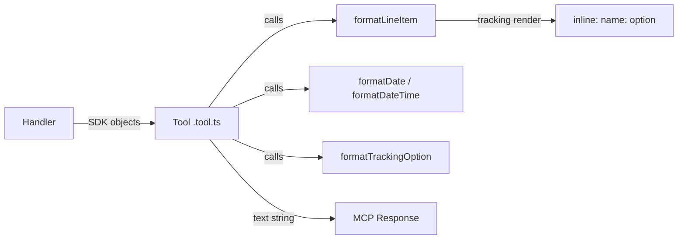

# Design: Response Formatting Fixes
**Layer:** backend
**Status:** Confirmed
**Last updated:** 2026-07-05
**Domain language:** Validated against `.specs/GLOSSARY.md` (one addition promoted: Formatter).

## Overview

Fix five object/fallback rendering defects (Group A) and standardise date rendering across ~45 interpolation sites (Group B) in Tool response formatters. All changes are rendering-only — no Tool parameter schema changes, no handler logic changes, no transport or auth changes.

The core implementation adds one new file (`src/helpers/format-date.ts`, two pure functions, ~15 LOC) and modifies `src/helpers/format-line-item.ts` (~10 LOC delta). The remaining ~45 call-site changes are mechanical: wrapping existing date interpolations in the new helpers and fixing five join/fallback expressions. Total core logic is ~25 LOC; per-site application is ~60 one-line edits across ~20 tool files.

**Upstream-isolation deviation:** This feature intentionally modifies upstream-owned files outside `src/http/` (helpers and tools). This is an owner-approved exception to ADR-0002 decision #5, accepted as a one-time merge cost. The invariant remains the default for all other features.

## Architecture

These changes sit entirely in the rendering layer between handlers and MCP response output. No new modules, no new dependencies, no new patterns — just fixing existing formatter output.



**Reusable code identified:**
- `formatLineItem` in `src/helpers/format-line-item.ts` — modified in place (tracking render + fallbacks).
- `formatTrackingOption` in `src/helpers/format-tracking-option.ts` — unchanged (it formats `TrackingOption` for category-list tools, distinct from `LineItemTracking` on line items).
- `getExternalLink` in `src/helpers/get-external-link.ts` — deleted (single-use, functionally a bug: `encodeURIComponent` on a display URL).

**Impacted code:**
- ~20 tool files under `src/tools/{list,create,update,get}/` receive import additions and inline edits.
- No handler files change. No type files change. No `tool-factory.ts` changes.
- `dist/` must be regenerated after build.

## Data Model

No database, schema, or model changes.

## API / Interface Design

No API contract changes. Tool parameter schemas (zod) are untouched. Only the rendered text content of `ToolResponse` objects changes.

## ADR Alignment

| ADR | Subject | Relationship |
|-----|---------|-------------|
| ADR-0002 | Upstream isolation (`src/http/` boundary) | **Documented exception.** This feature modifies upstream-owned files (`src/helpers/`, `src/tools/`). The deviation is owner-approved per PRD feature 004 and requirements.md. ADR-0002 decision #5 remains the default for all other features. No supersession — this is a scoped exception, not a policy change. |

No new ADR introduced. The deviation does not change the fork's architectural posture; it is a one-time rendering fix with an accepted merge cost.

## Component Breakdown

### 1. New file: `src/helpers/format-date.ts`

**Responsibility:** Two pure functions that normalise date values for Tool response rendering.

**Location:** `src/helpers/format-date.ts`

**Signature:**
```typescript
export function formatDate(value: Date | string | undefined): string | undefined;
export function formatDateTime(value: Date | undefined): string | undefined;
```

**Key logic — `formatDate`:**
- Returns `undefined` when `value` is nullish, letting call sites handle fallbacks with existing patterns (`?? "fallback"`, ternary + `null`, or `|| "fallback"`).
- **String input, date-prefixed (tz-safe fast path):** If `value` is a string matching `/^\d{4}-\d{2}-\d{2}/`, return `value.slice(0, 10)` directly. This covers both `"2022-07-22"` and `"2022-07-22T00:00:00"` without constructing a `Date`, eliminating the timezone off-by-one risk for tz-naive strings. This matters because stdio mode runs on the user's local machine (any timezone), not only the UTC Docker container.
- **`Date` input:** Use `value.toISOString().slice(0, 10)`. This is tz-safe because `toISOString()` always emits UTC, and xero-node `Date` fields from the SDK are UTC-midnight values.
- **Other string input** (e.g. `"28 June 2026"` from report `reportDate` fields): Parse via `new Date(value)`. If invalid (`isNaN(d.getTime())`), return `String(value)` as a passthrough. If valid, read back the **local** date components (`getFullYear()` / `getMonth()+1` / `getDate()`, zero-padded) and assemble `YYYY-MM-DD` — **not** `toISOString()`. Rationale: a non-ISO string like `"28 June 2026"` is parsed as local midnight; `toISOString()` would convert to UTC and shift the calendar day backwards in any positive-UTC-offset timezone (e.g. UTC+2 → `"2026-06-27"`). Reading local components returns the date that matches the input string in every process timezone (stdio on a user's laptop, Docker, CI). This is the same tz-correctness goal as the regex fast path, handled differently because the components can't be regex-extracted from an arbitrary human-readable format.

**Key logic — `formatDateTime`:**
- Signature is `(value: Date | undefined)` — deliberately **Date-only, no string branch**. `reference.md` confirms every timestamp field in scope (`updatedDateUTC`, `createdDateUTC`) is deserialized by xero-node as a `Date` at runtime — a string input never occurs. Narrowing the type pushes any accidental string caller to a compile-time error (repo's "prove it in CI" principle) rather than silently accepting a shape that cannot happen. This asymmetry with `formatDate` (which keeps the string branch, because real string date fields exist) is intentional.
- Returns `undefined` when `value` is nullish.
- **`Date` input:** Returns `value.toISOString()` → full ISO 8601 (`2026-07-05T15:07:49.000Z`).

**Design justification — two functions vs one with a flag:**
Two functions is chosen over a single `formatDate(value, mode)` because (a) the call site reads its intent at a glance (`formatDate` vs `formatDateTime`), (b) no flag parameter to misuse, (c) each is ~7 LOC — no duplication worth extracting further. This follows the KISS and Goldilocks principles.

**Design justification — string slice vs parse for `formatDate` calendar dates:**
The date-prefixed regex + slice approach avoids `Date` construction entirely for the most common string format from xero-node (`"YYYY-MM-DDTHH:MM:SS"`). ECMAScript parses tz-naive datetime strings as local time, so `new Date("2022-07-22T00:00:00").toISOString()` in UTC+2 yields `"2022-07-21T22:00:00.000Z"` — a day-shift bug. The slice approach extracts the calendar date directly from the string, making it timezone-immune and deterministic in every environment (stdio on a user's laptop, Docker, CI). For `Date` objects, `toISOString()` is inherently UTC and safe.

**Librarian-stage verification needed:** Which xero-node fields are `Date` vs `string`, and which are calendar-date vs timestamp, should be verified against live Xero API docs. The helper handles both types regardless, but correct `formatDate` vs `formatDateTime` selection at each call site depends on this.

### 2. Modified file: `src/helpers/format-line-item.ts`

**Responsibility:** Fix tracking render (A#1) and add absent-field fallbacks (A#1 noise, FR#2).

**Location:** `src/helpers/format-line-item.ts` (existing)

**Key changes:**
- **Tracking line:** Replace `Tracking: ${lineItem.tracking}` (produces `[object Object]`) with:
  - When `tracking` is non-empty: `Tracking: ${tracking.map(t => \`${t.name}: ${t.option}\`).join(", ")}` → e.g. `Tracking: Region: South, Channel: Online`.
  - When absent/empty: `Tracking: No tracking`.
  - This composes two existing repo idioms: colon key/value (`name: option`) and inline array join (`, ` from `list-contacts.tool.ts:68-69`).
- **Item line:** Replace `Item ID: ${lineItem.item}` (renders `[object Object]` or `undefined`) with `lineItem.item?.name ? \`Item: ${lineItem.item.name}\` : null` — the `item` field is a `LineItemItem` object, not a scalar. Omit the line when absent (matches ternary + null + `filter(Boolean)` pattern).
- **Fallback fields (per manual-journals precedent):**
  - `itemCode`: `lineItem.itemCode ? \`Item Code: ${lineItem.itemCode}\` : "No item code"`
  - `description`: `lineItem.description ? \`Description: ${lineItem.description}\` : "No description"`
  - `taxType`: `lineItem.taxType ? \`Tax Type: ${lineItem.taxType}\` : "No tax type"`
  - `accountCode`: `lineItem.accountCode ? \`Account Code: ${lineItem.accountCode}\` : "No account code"`
- **Always-present fields** (`quantity`, `unitAmount`, `lineAmount`): keep as-is (numeric, always present).
- Add `.filter(Boolean)` to the array before `.join("\n")`.

### 3. Modified file: `src/tools/list/list-organisation-details.tool.ts`

**Responsibility:** Fix payment terms (A#2), scalar fallbacks (A#3), external links (A#5), and two date sites.

**Key changes:**

**Payment terms (A#2):** Replace `Object.entries(organisation.paymentTerms).map(([key, value]) => \`${key}: ${value}\`)` with explicit rendering of the `PaymentTerm` object's `bills` and `sales` properties. The `PaymentTerm` type has `bills?: Bill` and `sales?: Bill`, where `Bill` has `day?: number` and `type?: PaymentTermType`. The fix renders each side explicitly:
```
Bills: Day 30, Type: DAYSAFTERBILLDATE
Sales: Day 14, Type: DAYSAFTERBILLDATE
```
When a side is absent: `No bills payment term` / `No sales payment term`. When the entire `paymentTerms` is absent: `No payment terms available.`

**Scalar fallbacks (A#3):** ~15 lines where `|| "No …"` sits outside the interpolation braces. Move the `||` inside: `${organisation.name || "No name available."}`. Affected fields: `name`, `legalName`, `shortCode`, `organisationID`, `version`, `baseCurrency`, `countryCode`, `timezone`, `financialYearEndDay`, `financialYearEndMonth`, `salesTaxBasis`, `salesTaxPeriod`, `edition`, `_class`.

**External links (A#5):** Replace `getExternalLink(link.url)` (which calls `encodeURIComponent`) with `link.url ?? "No URL"`. Remove the `getExternalLink` import.

**Date sites:** `periodLockDate` → `formatDate`, `createdDateUTC` → `formatDateTime` (also fixes the scalar fallback on this line).

### 4. Deleted file: `src/helpers/get-external-link.ts`

**Responsibility:** Remove the single-use helper that double-encodes URLs.

**Justification:** Only imported by `list-organisation-details.tool.ts`. The function body is `encodeURIComponent(url)` — encoding a display URL is a bug, not a feature. After removal, `link.url` is rendered directly.

### 5. Join fixes (A#4) — five sites across four files

Each site interpolates `.map(formatter)` (a `string[]`) without `.join()`, producing comma-glued output.

| File | Line | Current | Fix |
|------|------|---------|-----|
| `src/tools/list/list-invoices.tool.ts` | 85 | `Line Items: ${invoice.lineItems?.map(formatLineItem)}` | `invoice.lineItems?.length ? \`Line Items:\n${invoice.lineItems.map(formatLineItem).join("\n\n")}\` : "Line Items: No line items"` |
| `src/tools/list/list-bank-transactions.tool.ts` | 60 | `Line Items: ${transaction.lineItems?.map(formatLineItem)}` | Same pattern |
| `src/tools/list/list-tracking-categories.tool.ts` | 41 | `...tracking options:\n${category.options?.map(formatTrackingOption)}` | keep the `Found N tracking options:` count line, then `category.options?.length ? category.options.map(formatTrackingOption).join("\n\n") : "No tracking options"` (no separate `Tracking Options:` header — the count line is the only header) |
| `src/tools/create/create-tracking-options.tool.ts` | 33 | `...created:\n${trackingOptions.map(formatTrackingOption)}` | Add `.join("\n\n")` |
| `src/tools/update/update-tracking-options.tool.ts` | 39 | `...updated:\n${trackingOptions.map(formatTrackingOption)}` | Add `.join("\n\n")` |

### 6. Date standardisation (B) — ~45 sites across ~20 files

Each site wraps an existing date interpolation in `formatDate()` or `formatDateTime()`. The call-site pattern is preserved; only the value expression changes.

**Timestamp sites (15 — use `formatDateTime`):**

| File | Line | Field | Current rendering |
|------|------|-------|-------------------|
| `list-profit-and-loss.tool.ts` | 51 | `updatedDateUTC` | Already `.toISOString()` — replace with `formatDateTime` for consistency |
| `list-trial-balance.tool.ts` | 39 | `updatedDateUTC` | Already `.toISOString()` — same |
| `list-manual-journals.tool.ts` | 87 | `updatedDateUTC` | `.toLocaleDateString()` — replace with `formatDateTime` |
| `list-contacts.tool.ts` | 65 | `updatedDateUTC` | Raw interpolation |
| `list-invoices.tool.ts` | 72 | `updatedDateUTC` | Raw interpolation |
| `list-credit-notes.tool.ts` | 64 | `updatedDateUTC` | Raw interpolation |
| `list-quotes.tool.ts` | 66 | `updatedDateUTC` | Raw interpolation |
| `list-payments.tool.ts` | 14 | `updatedDateUTC` | Raw interpolation |
| `list-items.tool.ts` | 48 | `updatedDateUTC` | Raw interpolation |
| `list-payroll-employees.tool.ts` | 48 | `updatedDateUTC` | Raw interpolation |
| `list-payroll-timesheets.tool.ts` | 43 | `updatedDateUTC` | Raw interpolation |
| `list-payroll-employee-leave.tool.ts` | 42 | `updatedDateUTC` | Raw interpolation |
| `list-payroll-leave-types.tool.ts` | 39 | `updatedDateUTC` | Raw interpolation |
| `get-payroll-timesheet.tool.ts` | 53 | `updatedDateUTC` | Raw interpolation |
| `list-organisation-details.tool.ts` | 81 | `createdDateUTC` | Raw interpolation (also A#3 scalar fix) |

**Calendar date sites (30 — use `formatDate`):**

All remaining date sites from the grep. Fields: `date`, `dueDate`, `startDate`, `endDate`, `fullyPaidOnDate`, `periodLockDate`, `dateString`, `expiryDateString`, `reportDate`, `scheduleOfAccrualDate`, `periodStartDate`, `periodEndDate`.

Files touched: `list-invoices`, `list-bank-transactions`, `list-manual-journals`, `list-quotes`, `list-credit-notes`, `list-payments`, `list-payroll-timesheets`, `list-payroll-employees`, `list-payroll-employee-leave`, `list-payroll-employee-leave-types`, `list-payroll-leave-periods`, `list-aged-payables-by-contact`, `list-aged-receivables-by-contact`, `list-profit-and-loss`, `list-trial-balance`, `list-organisation-details`, `get-payroll-timesheet`, `create-invoice`, `create-bank-transaction`, `create-manual-journal`, `update-bank-transaction`, `update-payroll-timesheet-update-line`, `update-payroll-timesheet-add-line`.

Each site adds `import { formatDate, formatDateTime } from "../../helpers/format-date.js";` (once per file, importing only the needed function(s)) and wraps the value: `${formatDate(invoice.date)}` or `${formatDateTime(invoice.updatedDateUTC)}`. The surrounding guard and fallback pattern at each call site is preserved.

## Error Handling & Edge Cases

| Scenario | Handling |
|----------|----------|
| `formatDate` or `formatDateTime` receives `undefined` | Returns `undefined` — call site's existing guard (`? :`, `??`, `\|\|`) handles fallback text |
| `formatDate` receives an unparseable string | `isNaN(d.getTime())` triggers, returns `String(value)` — the original string passes through unmodified |
| `formatDate` receives a tz-naive date-prefixed string (e.g. `"2022-07-22T00:00:00"`) | The regex fast path (`/^\d{4}-\d{2}-\d{2}/`) matches and returns `value.slice(0, 10)` directly — no `Date` construction, no timezone shift. Safe in any process timezone (stdio on user's laptop, Docker, CI). |
| `formatDateTime` receives a non-`Date` | Cannot occur — the signature is `Date | undefined`, so a string caller is a compile-time error. No runtime handling needed. |
| `lineItem.tracking` is `undefined` or empty array | Renders `Tracking: No tracking` |
| `LineItemTracking` entry has `undefined` name or option | `${t.name}: ${t.option}` renders as `undefined: undefined` — acceptable; these fields should always be populated per Xero API. Librarian verifies. |
| `organisation.paymentTerms.bills` or `.sales` is undefined | Renders `No bills payment term` / `No sales payment term` |

## Security & Permissions

No security implications. Changes are rendering-only on existing data. No new inputs, no new outputs, no credential handling, no auth changes.

## Performance Considerations

Negligible — and note performance is **not** why the design is shaped this way. Each helper is a single string/`Date` operation, applied ~45 times per full tool-surface invocation (1-5 per tool). No async, no I/O, no caching. (The `formatDate` regex fast path exists for **timezone correctness**, not speed — see Component Breakdown; the avoided `Date` construction is an incidental side benefit, not the rationale. Do not remove the fast path on performance grounds.)

## Dependencies

- **Internal:** `xero-node` SDK types (`LineItem`, `LineItemTracking`, `LineItemItem`, `PaymentTerm`, `Bill`, `PaymentTermType`, `TrackingOption`). No new SDK imports — all types are already used by the files being modified.
- **External:** None. No new npm packages.

## Testing Strategy

**Mode:** full-tdd
**Rationale:** `formatDate`, `formatDateTime`, and `formatLineItem` are pure functions with no I/O, no mocking needed, and deterministic outputs — the ideal full-tdd case.
**Framework:** Vitest 4.x (already configured in `vitest.config.ts`, `package.json`)

**Test files:**
1. `src/helpers/__tests__/format-date.test.ts` — tests for `formatDate` and `formatDateTime`
2. `src/helpers/__tests__/format-line-item.test.ts` — tests for `formatLineItem`

**Existing infrastructure reused:**
- Vitest config at `/Users/llewellyn/Code/xero-mcp/vitest.config.ts` (includes `src/**/*.test.ts`)
- Test directory convention: `src/helpers/__tests__/` (existing; contains `format-error.test.ts`)
- Import pattern: `import { describe, it, expect } from "vitest";`
- No test fixtures or factories needed — inputs are plain objects

**Commands:**
- Run all tests: `npm run test`
- Run helper tests only: `npx vitest run src/helpers/__tests__/`
- Run with coverage: `npm run test:coverage`

**Test plan for `format-date.test.ts`:**
- `formatDate` with `Date` object input → `YYYY-MM-DD`
- `formatDate` with `YYYY-MM-DD` string input → same string back (slice passthrough)
- `formatDate` with tz-naive Xero datetime string (`"2022-07-22T00:00:00"`) → `"2022-07-22"` (tz-safe: uses regex+slice, not `Date` construction — deterministic regardless of process timezone)
- `formatDate` with `undefined` → `undefined`
- `formatDate` with non-date-prefixed parseable string (e.g. `"28 June 2026"`) → `YYYY-MM-DD` via `Date` parse
- `formatDate` with unparseable string → original string passthrough
- `formatDateTime` with `Date` object input → ISO 8601
- `formatDateTime` with `undefined` → `undefined`

**Test plan for `format-line-item.test.ts`:**
- Single tracking entry → `Tracking: Region: South`
- Multiple tracking entries → `Tracking: Region: South, Channel: Online`
- No tracking (undefined) → `Tracking: No tracking`
- Empty tracking array → `Tracking: No tracking`
- Missing `itemCode` → `No item code`
- Missing `taxType` → `No tax type`
- Missing `description` → `No description`
- Missing `accountCode` → `No account code`
- Item object present → `Item: <name>`
- Item absent → line omitted
- All fields present → full multi-line output with no `undefined` or `[object Object]`

## Examples

**Example 1 — Single tracking entry on a line item**
- Given: `lineItem` with `tracking = [{ name: "Region", option: "South" }]`
- When: `formatLineItem(lineItem)` is called
- Then: output contains `Tracking: Region: South`
- AC: AC 1

**Example 2 — Multiple tracking entries on a line item**
- Given: `lineItem` with `tracking = [{ name: "Region", option: "South" }, { name: "Channel", option: "Online" }]`
- When: `formatLineItem(lineItem)` is called
- Then: output contains `Tracking: Region: South, Channel: Online`
- AC: AC 2

**Example 3 — Absent tracking on a line item**
- Given: `lineItem` with `tracking = undefined`
- When: `formatLineItem(lineItem)` is called
- Then: output contains `Tracking: No tracking`
- AC: AC 3

**Example 4 — Empty tracking array on a line item**
- Given: `lineItem` with `tracking = []`
- When: `formatLineItem(lineItem)` is called
- Then: output contains `Tracking: No tracking`
- AC: AC 3

**Example 5 — Missing itemCode and taxType fallbacks**
- Given: `lineItem` with `itemCode = undefined`, `taxType = undefined`
- When: `formatLineItem(lineItem)` is called
- Then: output contains `No item code` and `No tax type` (no literal `undefined`)
- AC: AC 5

**Example 6 — All line item fields present**
- Given: `lineItem` with `description = "Widget"`, `quantity = 2`, `unitAmount = 10.00`, `accountCode = "200"`, `taxType = "OUTPUT2"`, `itemCode = "WIDGET-001"`, `lineAmount = 20.00`, `tracking = [{ name: "Region", option: "South" }]`, `item = { name: "Widget", itemID: "abc-123" }`
- When: `formatLineItem(lineItem)` is called
- Then: output is a multi-line string with no `undefined`, no `[object Object]`, containing `Item: Widget`, `Item Code: WIDGET-001`, `Description: Widget`, `Quantity: 2`, `Unit Amount: 10`, `Account Code: 200`, `Tax Type: OUTPUT2`, `Tracking: Region: South`, `Line Amount: 20`
- AC: AC 5

**Example 7 — formatDate with Date object**
- Given: `value = new Date("2026-07-04T00:00:00.000Z")`
- When: `formatDate(value)` is called
- Then: returns `"2026-07-04"`
- AC: AC 10

**Example 8 — formatDate with tz-naive Xero datetime string (timezone-safe)**
- Given: `value = "2022-07-22T00:00:00"` (no timezone designator — the format xero-node uses for date-string fields like `quote.dateString`)
- When: `formatDate(value)` is called
- Then: returns `"2022-07-22"` (extracted via regex+slice, not `Date` construction — deterministic regardless of process timezone; a user in UTC+2 gets the same result as CI in UTC)
- AC: AC 10

**Example 9 — formatDate with undefined**
- Given: `value = undefined`
- When: `formatDate(value)` is called
- Then: returns `undefined`
- AC: AC 10

**Example 10 — formatDate with unparseable string**
- Given: `value = "not-a-date"`
- When: `formatDate(value)` is called
- Then: returns `"not-a-date"` (passthrough)
- AC: AC 10

**Example 11 — formatDateTime with Date object**
- Given: `value = new Date("2026-07-05T15:07:49.000Z")`
- When: `formatDateTime(value)` is called
- Then: returns `"2026-07-05T15:07:49.000Z"`
- AC: AC 11

**Example 12 — formatDateTime with undefined**
- Given: `value = undefined`
- When: `formatDateTime(value)` is called
- Then: returns `undefined`
- AC: AC 11

**Example 13 — Date consistency within list-quotes**
- Given: a quote with `dateString = "2022-07-22T00:00:00"` and `updatedDateUTC = new Date("2022-07-22T14:30:00.000Z")`
- When: the quote is rendered by `list-quotes`
- Then: output contains `Quote Date: 2022-07-22` and `Last Updated: 2022-07-22T14:30:00.000Z` (both standard, no mixed styles)
- AC: AC 12

**Example 14 — formatDate with non-date-prefixed parseable string**
- Given: `value = "28 June 2026"` (human-readable format from Xero report `reportDate` fields)
- When: `formatDate(value)` is called
- Then: returns `"2026-06-28"` (parsed via `new Date()`, reformatted)
- AC: AC 10

## Open Questions

None blocking. All design decisions are resolved:
- Two helpers (not one) — justified above.
- Regex+slice for calendar dates from strings (not full parse) — justified above; eliminates tz-shift risk.
- Tracking render is inline in `formatLineItem` (not a separate helper) — the expression is trivial and specific to line-item context.
- `getExternalLink` is deleted (not modified) — single-use, the function is the bug.
- `lineItem.item` rendered as `item.name` when present, omitted when absent — the `item` field is a `LineItemItem` object; rendering the whole object would produce `[object Object]`.
- `reportDate` on report objects: string field, passed through `formatDate` which normalises or passes through if unparseable. Librarian verifies actual format.
