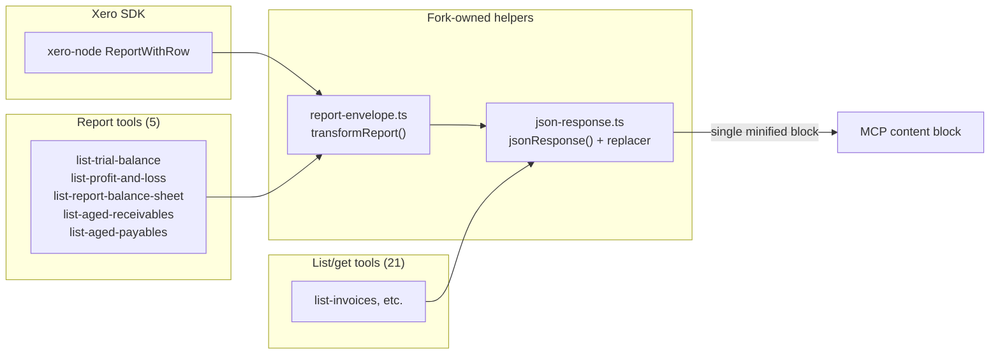

# Design: 007-response-shape

**Layer:** backend
**Status:** Confirmed
**Last updated:** 2026-07-20
**Domain language:** Validated against `.specs/GLOSSARY.md` (additions promoted in step 4b: report envelope, empty-value omission).

## Overview

Three changes to the serialization path, one to the accounts tool, all driven by post-v0.3.1
tester feedback. (1) The `JSON.stringify` replacer in `json-response.ts` gains empty-value
omission (`""`, `null` -> drop; `0`, `false` -> keep) and the pretty-print `null, 2` indentation
on report tools is replaced by the existing `jsonResponse` choke point (single minified block).
(2) A new fork-owned helper `src/helpers/report-envelope.ts` transforms a `ReportWithRow` into the
structured report envelope (`{report, date, updatedAt, columns, sections}`) -- one generic
transformer for all 5 report tools. (3) The `list-accounts` handler accepts an optional `where`
clause so the tool can pass `Status=="ACTIVE"` by default. All three flow through the existing
`jsonResponse` serialization choke point, so empty-value omission and credential redaction apply
uniformly.

## Architecture



The report envelope helper sits between the handlers (which return `ReportWithRow`) and
`jsonResponse`. All other tools already flow through `jsonResponse`/`listResponse` from 006.
Empty-value omission lives inside the `JSON.stringify` replacer in `jsonResponse` -- a single
line of code change, universal to every read tool.

**Existing code reused without modification:**
- `jsonResponse`/`listResponse` API surface and `REDACTED_KEYS` mechanism (extended, not changed)
- All 5 report handlers (unchanged -- they return `ReportWithRow` to the tool layer)
- `CreateXeroTool` factory, `XeroClientResponse<T>` discriminated union
- `formatDate`/`formatDateTime` helpers (reused inside report-envelope for header fields)
- All 21 non-report read tools (benefit from empty-value omission via the shared replacer)

**Existing code modified (minimal diffs in upstream-owned files):**
- `src/helpers/json-response.ts` -- replacer gains empty-value omission (fork-owned)
- `src/tools/list/list-trial-balance.tool.ts` -- replace 4 content blocks with `reportResponse`
- `src/tools/list/list-profit-and-loss.tool.ts` -- same pattern
- `src/tools/list/list-report-balance-sheet.tool.ts` -- same pattern
- `src/tools/list/list-aged-receivables-by-contact.tool.ts` -- same pattern
- `src/tools/list/list-aged-payables-by-contact.tool.ts` -- same pattern
- `src/handlers/list-xero-accounts.handler.ts` -- `listXeroAccounts` accepts optional `where`
- `src/tools/list/list-accounts.tool.ts` -- adds `activeOnly` param, passes `where` to handler

**Code that becomes dead after this feature:**
- `src/helpers/format-aged-report-filter.ts` -- only used by the 2 aged-report tools; their
  filter text block is replaced by the report envelope. Delete it.

## Data Model

No database changes. The transformation is purely at the serialization layer.

### Report envelope shape (output of `transformReport`)

```ts
interface ReportEnvelope {
  report: string;                      // reportName
  date?: string;                       // reportDate, formatted YYYY-MM-DD (absent on some reports, e.g. balance sheet)
  updatedAt?: string;                  // updatedDateUTC, ISO string (absent when Xero omits it)
  columns: string[];                   // column titles from Header row ("" -> "label"; duplicates suffixed " (2)", " (3)", …)
  sections: ReportSection[];
}

interface ReportSection {
  title: string;                       // section title (verbatim, including "")
  rows?: ReportDataRow[];              // the TRANSFORMER omits this key when the section has no data
                                       // rows (the replacer never prunes arrays — [] is not ""/null)
  total?: ReportDataRow;               // SummaryRow, if present; likewise omitted by the transformer
}

// Each key is a column title (or "label" for empty-title columns).
// "attributes" is present only when the row has non-empty attributes.
type ReportDataRow = Record<string, string> & {
  attributes?: Record<string, string>;
};
```

### xero-node input shape (for reference)

```
ReportWithRow
  .reportName?: string
  .reportDate?: string
  .updatedDateUTC?: Date
  .rows?: ReportRows[]             -- top-level: Header | Section | SummaryRow

ReportRows
  .rowType?: RowType               -- "Header" | "Section" | "Row" | "SummaryRow"
  .title?: string
  .cells?: ReportCell[]            -- on Header and SummaryRow rows
  .rows?: ReportRow[]              -- on Section rows (nested data rows)

ReportRow
  .rowType?: RowType               -- "Row" | "SummaryRow"
  .cells?: ReportCell[]

ReportCell
  .value?: string
  .attributes?: ReportAttribute[]

ReportAttribute
  .id?: string
  .value?: string
```

## ADR Alignment

- **ADR-0005 (raw JSON output contract)** -- **Extended**. ADR-0005 established raw-JSON
  passthrough for list/get tools and deferred the 5 report tools. This feature extends the
  contract: list/get tools stay raw-passthrough (gaining empty-value omission); report tools
  get a structured lossless envelope (not raw passthrough, because the raw `ReportWithRow` tree
  is bloated and unreadable). A new **ADR-0006** (draft) records this refinement.
- **No other ADRs overlap.** ADR-0001 (auth), ADR-0002 (HTTP transport), ADR-0003 (Redis),
  ADR-0004 (OAuth bridge) are unrelated.

**New ADR introduced:** ADR-0006 -- "Report envelope and empty-value omission" (`Status: Draft`).
Records: (a) report tools return a structured envelope instead of raw passthrough; (b) the
`jsonResponse` replacer omits empty values globally. Written alongside this design; accepted on
ship.

## Component Breakdown

### 1. Empty-value omission in `json-response.ts` replacer

- **Responsibility:** Drop keys with `""` or `null` values during serialization; preserve `0` and
  `false`. Handle the empty-object question (see below).
- **Location:** `src/helpers/json-response.ts` (fork-owned)
- **Key logic:** The existing replacer function `(key, v) => REDACTED_KEYS.has(key) ? undefined : v`
  gains two additional guards:
  ```
  if (v === "" || v === null) return undefined;
  ```
  This runs inside `JSON.stringify`'s replacer, which visits values depth-first. `0` and `false`
  pass through because they are neither `""` nor `null`.

  **Empty-object resolution:** `JSON.stringify` calls the replacer on an object *before*
  serializing its children. A pre-pass (walk the tree first, prune, then stringify) would work
  but adds complexity for negligible gain. The simplest correct approach: accept that `{}` objects
  remain after child filtering. A `salesDetails: {}` is harmless -- it tells the consumer the key
  exists but has no populated fields. This is explicitly a non-goal to solve (`{}` survival is
  accepted; the alternative adds a recursive pre-pass for cosmetic benefit).

### 2. `reportResponse` convenience function in `report-envelope.ts`

- **Responsibility:** Compose `transformReport` + `jsonResponse` into a single call for tool files.
- **Location:** `src/helpers/report-envelope.ts` (fork-owned) — NOT `json-response.ts`: the
  dependency must point specific → generic (report-envelope imports jsonResponse), keeping the
  generic serialization helper free of report knowledge.
- **Key logic:**
  ```ts
  export function reportResponse(report: ReportWithRow) {
    return jsonResponse(transformReport(report));
  }
  ```
  Keeps the 5 tool files one-liners on the success path (`return reportResponse(response.result)`).

### 3. Report envelope transformer -- `src/helpers/report-envelope.ts`

- **Responsibility:** Transform a `ReportWithRow` into the report envelope shape. Single generic
  function for all 5 report types.
- **Location:** `src/helpers/report-envelope.ts` (new, fork-owned)
- **Key logic:**

  **`transformReport(report: ReportWithRow): ReportEnvelope`**

  1. Extract header fields: `report` from `reportName`, `date` from `reportDate` (via `formatDate`),
     `updatedAt` from `updatedDateUTC` (via `formatDateTime`).

  2. Extract `columns`: find the first top-level `ReportRows` with `rowType === "Header"`, read its
     `cells[].value`. Map empty-string titles to `"label"`. If two columns end up with the same
     title (possible in comparative/tracking reports), suffix duplicates `" (2)"`, `" (3)"`, … so
     no cell value is silently lost to a key collision.

  3. Walk the remaining top-level `ReportRows` entries. For each:

     - **`rowType === "Section"`**: create a section with `title` from the row's `title` field. Walk
       its nested `rows`:
       - **`rowType === "Row"`**: transform cells into a column-keyed object (cell value at column
         index; skip cells with empty/missing value -- empty-value omission in the replacer handles
         this, but doing it here too avoids creating keys that the replacer would just drop). Collect
         all non-empty `attributes` from all cells into a single deduplicated `attributes` object
         (`{id: value}`). First-wins on id collision (deterministic, unobserved in practice).
       - **`rowType === "SummaryRow"`**: same cell-to-object transformation, stored as the section's
         `total` instead of appended to `rows`.
       - **Unknown `rowType`**: log a warning via `console.warn` (fail loud -- surfaces in pod logs)
         and skip the row. This ensures new Xero row types don't silently corrupt the envelope; the
         warning makes the issue visible without crashing the tool.

     - **`rowType === "SummaryRow"` at top level**: Xero places top-level summary rows (observed:
       none in current reports, but structurally possible). Wrap in a synthetic section with
       `title: ""` and the row as `total`.

     - **Unknown `rowType` at top level**: `console.warn` and skip, same as nested.

  4. Return the envelope object. The transformer itself omits `rows`/`total` keys on sections
     without them (the replacer never prunes empty arrays — `[]` is neither `""` nor `null`).
     **Empty-title sections:** the transformer sets `title: row.title ?? ""`; the global replacer
     then drops the `""` title from the JSON, so an empty-title section serializes as
     `{"rows":[...]}` or `{"total":{...}}` — unambiguous, and section ordering/grouping is fully
     preserved. No sentinel or special-casing.

  **Edge cases from requirements, handled explicitly:**

  | Edge case | Handling |
  |-----------|----------|
  | Empty column title | Keyed as `"label"` in columns array and in row objects |
  | Label-only sections (no `rows` key, e.g. "Assets") | Section object with `title` only; the transformer never sets `rows`/`total` keys it has no data for |
  | `SummaryRow` in a section | Becomes the section's `total` object |
  | Computed rows (Gross Profit, Net Profit, Net Assets) | Ordinary rows in their section |
  | Per-row attribute dedup | All cell attributes merged into one `attributes` object; distinct `id`/`value` pairs kept. Retained Earnings: `account` + `toDate` (fromDate dropped as empty). P&L FX: `account` + `groupID`. |
  | Attribute id collision across cells with differing values | First-wins (deterministic). Unobserved in real data. |
  | Cell values are verbatim strings | No parsing; `"123"` stays `"123"` |
  | `0`/`false` survive omission | Handled by the replacer: only `""` and `null` are dropped |

### 4. Tool file changes -- 5 report tools

- **Responsibility:** Replace the multi-block prose + pretty-printed JSON with a single
  `reportResponse(response.result)` call.
- **Locations:** `src/tools/list/list-trial-balance.tool.ts`,
  `list-profit-and-loss.tool.ts`, `list-report-balance-sheet.tool.ts`,
  `list-aged-receivables-by-contact.tool.ts`, `list-aged-payables-by-contact.tool.ts`
- **Key logic:** Each tool's success branch becomes:
  ```ts
  return reportResponse(response.result);
  ```
  The error branch stays unchanged (text error message).
  Imports added: `reportResponse` from `json-response.ts`.
  Imports removed: `formatDate`, `formatDateTime`, `formatAgedReportFilter` (as applicable).
- **Tool descriptions updated** to document the report envelope shape.

### 5. `activeOnly` on list-accounts

- **Handler change** (`src/handlers/list-xero-accounts.handler.ts`):
  `listXeroAccounts` gains an optional `where?: string` parameter, passed through to
  `xeroClient.accountingApi.getAccounts` as the third positional argument (currently `undefined`).
  ```ts
  async function listAccounts(where?: string): Promise<Account[]> {
    // ...
    const response = await xeroClient.accountingApi.getAccounts(
      xeroClient.tenantId,
      undefined,  // ifModifiedSince
      where,      // where clause
      undefined,  // order
      getClientHeaders(),
    );
    // ...
  }

  export async function listXeroAccounts(where?: string) {
    const accounts = await listAccounts(where);
    // ...
  }
  ```

- **Tool change** (`src/tools/list/list-accounts.tool.ts`):
  Add `activeOnly` boolean param (default `true`). When `true` (or absent), pass
  `'Status=="ACTIVE"'` as the `where` clause. When `false`, pass `undefined`.
  ```ts
  const ListAccountsTool = CreateXeroTool(
    "list-accounts",
    "Lists accounts in Xero. Returns only active accounts by default (activeOnly=true); "
    + "set activeOnly=false to include archived accounts.",
    {
      activeOnly: z.boolean().optional().default(true)
        .describe("When true (default), returns only ACTIVE accounts. Set false to include ARCHIVED."),
    },
    async ({ activeOnly }) => {
      const where = activeOnly !== false ? 'Status=="ACTIVE"' : undefined;
      const response = await listXeroAccounts(where);
      // ... error handling unchanged ...
      return listResponse(response.result);
    },
  );
  ```

### 6. Dead code removal

- **`src/helpers/format-aged-report-filter.ts`** -- only imported by the 2 aged-report tools.
  After converting those tools to `reportResponse`, this helper is orphaned. Delete it.

## Error Handling & Edge Cases

| Failure mode | Handling |
|---|---|
| Report handler returns `null` (empty Xero response) | Existing error path: `result: null, isError: true` -> tool returns error text. `transformReport` is never called. |
| Unknown `rowType` in Xero response | `console.warn` + skip the row. Ensures forward compatibility if Xero adds row types. Surfaces in pod logs without crashing. |
| Report with no Header row | `columns` defaults to `[]`. Rows are keyed by index fallback (column `0`, `1`, ...) -- but this is purely defensive; all 5 reports have a Header row. |
| Attribute `id` collision (same `id`, different `value` across cells in a row) | First-wins (deterministic). Unobserved in live data; defined here so behavior is not ambiguous. |
| Xero `where` clause on accounts fails | Handler's existing `catch` returns `formatError(error)` text to the tool. |
| Aged-report tools fail live | **Out of scope.** The transformer is unit-tested with fixtures; the live failure is a separate backlog item (`aged-reports-live-failure.md`). |

## Security & Permissions

No new auth/access concerns. The `REDACTED_KEYS` mechanism in `jsonResponse` continues to
redact `aPIKey` from all tool output. Report data is no more sensitive than the raw
`ReportWithRow` the tools already returned. `activeOnly` filtering is not a security boundary --
it is a convenience default.

## Performance Considerations

- **Empty-value omission** reduces payload sizes across all tools. The replacer check
  (`v === "" || v === null`) is O(1) per key -- negligible overhead.
- **Report transformation** is a single pass over the `ReportWithRow` tree. Trial balance
  (the largest report: 441 KB raw, projected ~69 KB after hoisting + minification) processes
  in under 1 ms.
- **`activeOnly` filtering** is server-side (Xero `where` clause), not client-side. No
  performance regression; slightly faster responses (574 vs 609 rows).

## Dependencies

- **Internal:** `src/helpers/json-response.ts` (FR 1-2), `src/helpers/format-date.ts`
  (report header formatting), all 5 report tool/handler pairs, accounts tool/handler pair.
- **External:** `xero-node` types (`ReportWithRow`, `ReportRows`, `ReportRow`, `ReportCell`,
  `ReportAttribute`, `RowType`, `Account`). No new dependencies.

## Upstream-Isolation Exception

This feature modifies upstream-owned files (5 report tool files, 1 accounts handler, 1 accounts
tool) following the owner-approved precedent set by features 004, 005, and 006. The diffs are
minimal: each report tool replaces 3-4 content blocks with a single `reportResponse` call; the
accounts handler gains one optional parameter. New logic lives in fork-owned helpers
(`report-envelope.ts`, `json-response.ts`).

`git diff upstream/main -- src/ ':!src/http'` remains non-empty for this additional, named reason
on top of features 004, 005, and 006's exceptions. REPO.md will be updated with the feature-007
exception note.

## Versioning

Shipped as **v0.4.0** (minor bump -- output contract change for report tools, new default behavior
on `list-accounts`). Same release flow as 006 (v0.3.0) and the redaction hotfix (v0.3.1): merge to
`main` -> `build-publish` -> dev rollout -> tag -> `release`.

## Testing Strategy

**Mode:** full-tdd
**Rationale:** Pure transform and serialization logic (`transformReport`, replacer changes) is
deterministically unit-testable with fixture data. The accounts `activeOnly` param is testable
via mocked handler. All components have runtime behavior worth asserting.
**Framework:** Vitest 4.x (already configured: `vitest.config.ts`, `npm run test`)
**Test location:** `src/__tests__/helpers/` and `src/__tests__/tools/`
**Commands:**
  - Run:      `npm run test`
  - Build:    `npm run build`
  - Lint:     `npm run lint`
**Done when:** All tests green. `npm run build` passes (strict TS). No regressions in existing
suites (json-response, list-invoices, list-organisation-details, xero-client, http).

### Test files

1. **`src/__tests__/helpers/report-envelope.test.ts`** (new) -- exercises `transformReport` with
   fixture `ReportWithRow` trees modeled on real measured payloads.

2. **`src/__tests__/helpers/json-response.test.ts`** (extend) -- add cases for empty-value
   omission and `reportResponse`.

3. **`src/__tests__/tools/list-trial-balance.tool.test.ts`** (new) -- vi.hoisted mock handler,
   invoke tool, assert single minified block with report envelope shape. Pattern:
   `list-invoices.tool.test.ts`.

4. **`src/__tests__/tools/list-accounts.tool.test.ts`** (new) -- vi.hoisted mock handler, assert
   `where` clause passed for default and explicit `activeOnly: false`.

### Fixture strategy

Report tests use inline fixture objects (not file-based JSON) to keep tests self-contained and
readable. Fixtures model the structural shapes from the 5 real reports (TB, P&L, balance sheet,
aged receivables, aged payables) with enough rows to exercise: multi-cell attribute dedup, empty
column titles, label-only sections, SummaryRow -> total, computed rows in empty-title sections.
The aged-report fixtures cover the structural shape (despite the live failure) so the transformer
is proven correct for those tools.

## Examples

**Example 1 -- Trial balance single minified block**
- Given: a mock `ReportWithRow` with `reportName: "Trial Balance"`, `reportDate: "20 July 2026"`, one Header row with cells `["Account", "", "Debit", "Credit"]`, one Section "Revenue" with one Row
- When: `list-trial-balance` tool is called
- Then: response has exactly 1 content block; text starts with `{"report":"Trial Balance"` and contains no `\n` characters; `columns` is `["Account","label","Debit","Credit"]`
- AC: AC 1

**Example 2 -- Empty-value omission drops padding cells**
- Given: a row object `{ Account: "Sales (200)", Debit: "", Credit: "5000.00", YTDDebit: "" }`
- When: serialized through `jsonResponse`
- Then: parsed JSON has keys `Account` and `Credit` only; `Debit` and `YTDDebit` are absent
- AC: AC 2

**Example 3 -- Zero and false survive omission**
- Given: an object `{ name: "Petty Cash", balance: 0, hasAttachments: false, code: "" }`
- When: serialized through `jsonResponse`
- Then: parsed JSON equals `{ name: "Petty Cash", balance: 0, hasAttachments: false }`; `code` is absent
- AC: AC 2, AC 7

**Example 4 -- Null omitted, undefined omitted**
- Given: an object `{ name: "Widget", quantityOnHand: null, purchaseDescription: "" }`
- When: serialized through `jsonResponse`
- Then: parsed JSON equals `{ name: "Widget" }`
- AC: AC 7

**Example 5 -- Attributes hoisted and deduplicated per row**
- Given: a Row with 5 cells; cell 0 has attributes `[{id:"account", value:"0aa0e7a2-xxx"}]`; cells 1-4 each have attributes `[{id:"account", value:"0aa0e7a2-xxx"}, {id:"toDate", value:"2/28/2026"}]`; cells 2-4 also have `{id:"fromDate", value:""}`
- When: `transformReport` processes this row
- Then: row has exactly one `attributes` object equal to `{"account":"0aa0e7a2-xxx","toDate":"2/28/2026"}`; no `fromDate` key (empty value dropped)
- AC: AC 3

**Example 6 -- Section total from SummaryRow**
- Given: a Section "Bank" with one Row and one SummaryRow (cells: `["Total Bank", "10000.00"]`)
- When: `transformReport` processes this section
- Then: section has `total` with `label: "Total Bank"` (empty column title keyed as `"label"`); total is not in `rows`
- AC: AC 4

**Example 7 -- Label-only section preserved**
- Given: a Section with `title: "Assets"` and no nested `rows` array (or empty `rows`)
- When: `transformReport` processes this section
- Then: section appears in output as `{"title":"Assets"}` (no `rows` key, no `total` key)
- AC: AC 4

**Example 8 -- Computed row stays as ordinary row**
- Given: a report whose Header cells are `["", "Amount"]`, and a Section `""` (empty title) with a Row whose cells are `["Net Assets", "500000.00"]`
- When: `transformReport` processes this section
- Then: the section serializes as `{"rows":[{"label":"Net Assets","Amount":"500000.00"}]}` — no `title` key (empty string dropped by the replacer), row in `rows`, not `total`
- AC: AC 4

**Example 9 -- Attribute id collision: first wins**
- Given: a Row with 2 cells; cell 0 has `{id:"account", value:"aaa"}`, cell 1 has `{id:"account", value:"bbb"}`
- When: `transformReport` processes this row
- Then: `attributes.account` is `"aaa"` (first wins)
- AC: AC 3

**Example 10 -- activeOnly default filters to ACTIVE**
- Given: mock handler `listXeroAccounts` that captures the `where` argument
- When: `list-accounts` tool is called with no arguments
- Then: handler was called with `where: 'Status=="ACTIVE"'`; response envelope has `showing` equal to the mock result length
- AC: AC 5

**Example 11 -- activeOnly false returns all accounts**
- Given: mock handler `listXeroAccounts` that captures the `where` argument
- When: `list-accounts` tool is called with `{ activeOnly: false }`
- Then: handler was called with `where: undefined`
- AC: AC 5

**Example 12 -- Report with no data rows (empty report)**
- Given: a `ReportWithRow` with a Header row and one Section with `title: "Revenue"` and empty `rows: []`
- When: `transformReport` processes it
- Then: `sections` contains `[{"title":"Revenue"}]` (the transformer omits the `rows` key when there are no data rows)
- AC: AC 6

**Example 13 -- Cell values are verbatim strings, never parsed**
- Given: a Row where cell 0 (column "Account") has value `"123"` and cell 1 (column "Debit") has value `"0.00"`
- When: `transformReport` processes this row
- Then: row object contains `"Account":"123"` and `"Debit":"0.00"` (both strings, no numeric coercion)
- AC: AC 6

**Example 14 -- reportResponse composes transform + serialize**
- Given: a minimal `ReportWithRow` with `reportName: "Balance Sheet"`, Header, and one empty Section "Assets"
- When: `reportResponse(report)` is called
- Then: returns `{ content: [{ type: "text", text: <minified JSON> }] }` where parsed text has `report: "Balance Sheet"` and `sections: [{"title":"Assets"}]`
- AC: AC 1, AC 4

**Example 15 -- Tool description documents the envelope**
- Given: `list-trial-balance` tool definition
- When: its `description` string is inspected
- Then: it mentions the report envelope shape (sections, columns)
- AC: AC 6 (tool descriptions document the shape)

## Open Questions

None remaining. The empty-object (`{}`) question from requirements is resolved: `{}` objects
survive after child filtering, and this is accepted as correct behavior (not load-bearing).
